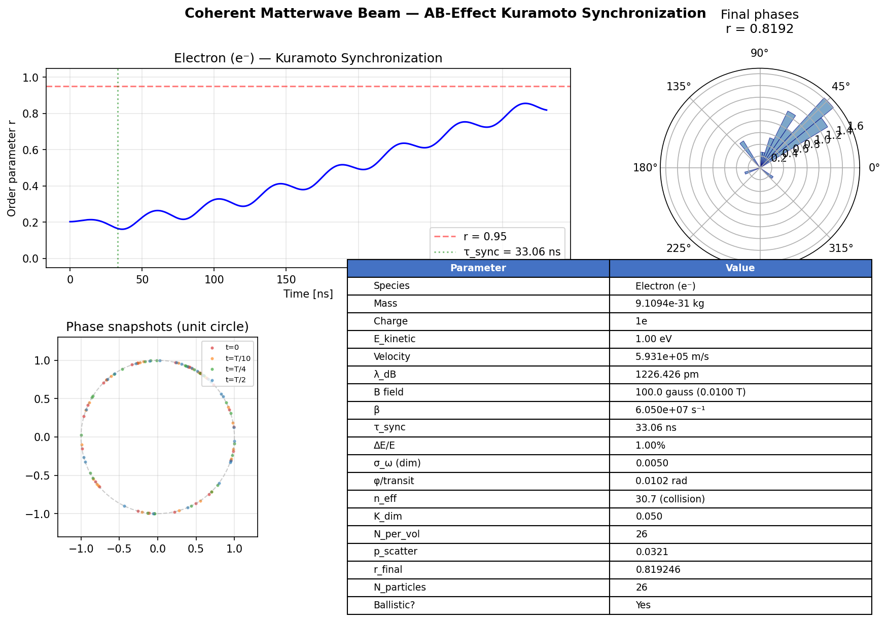
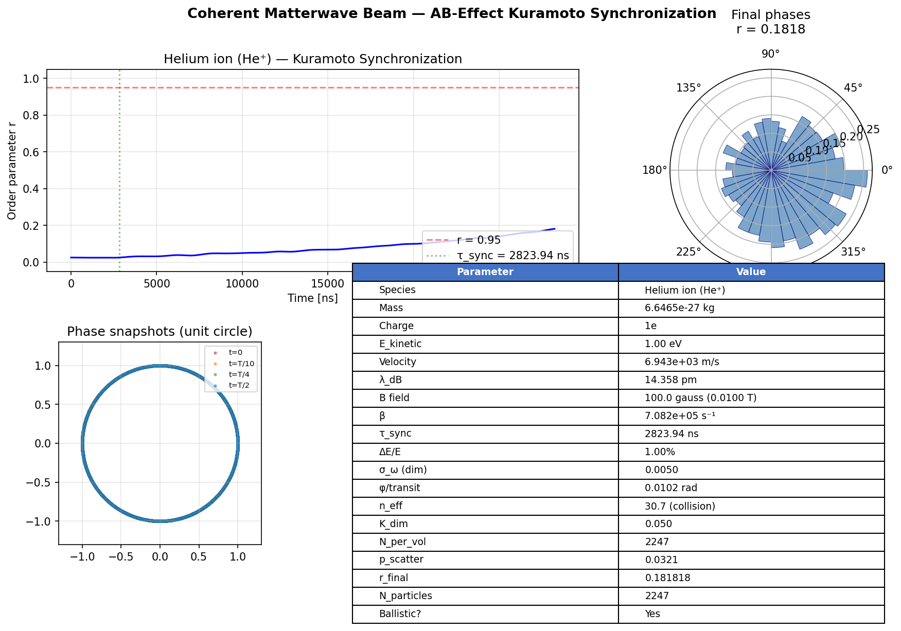
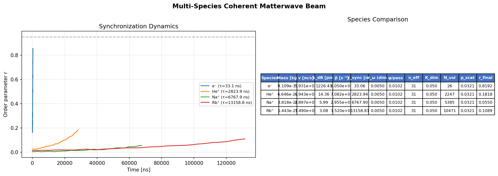
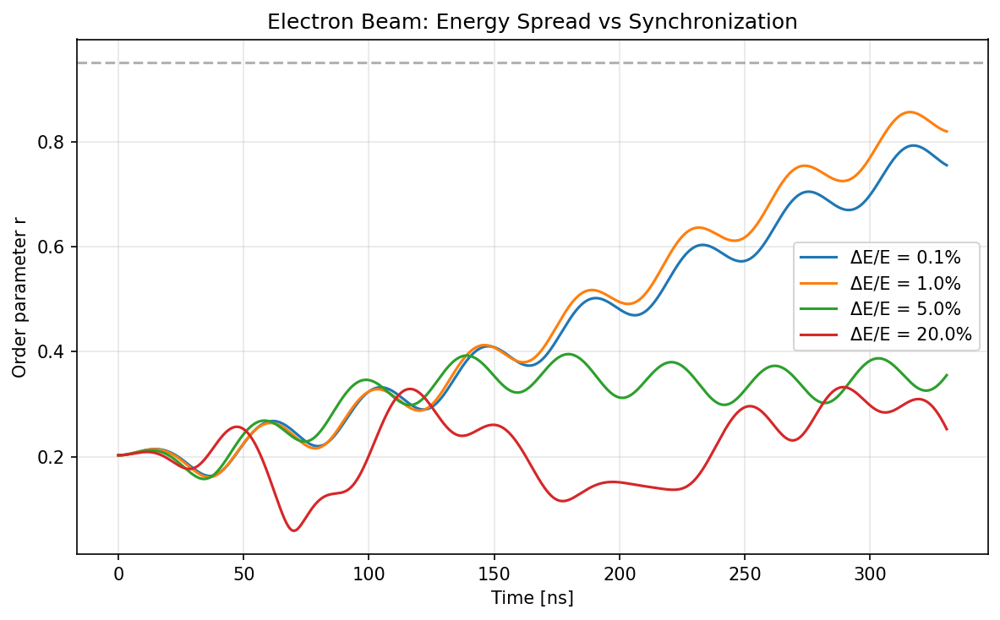
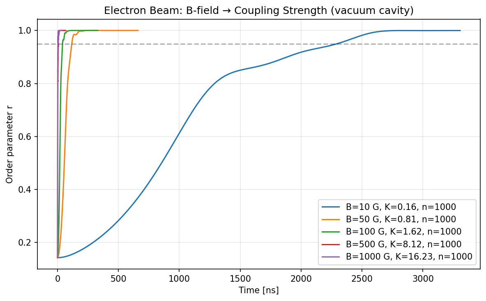
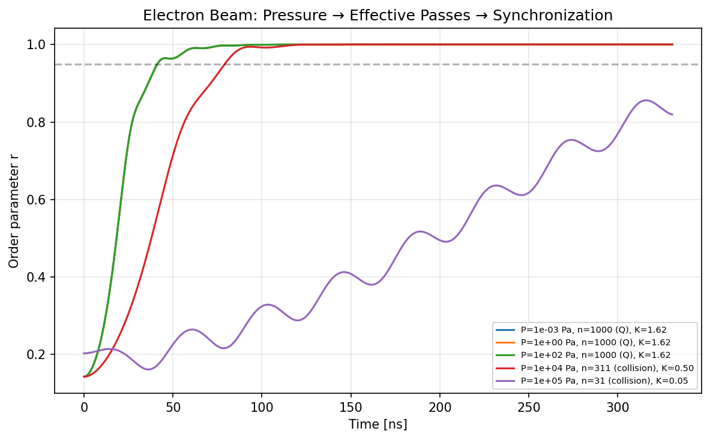
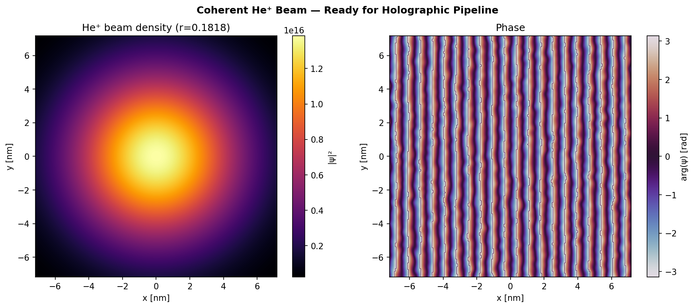

# Coherent Matterwave Beam Simulator — Lab Report

## 1. Overview

This report documents the simulation results from the Coherent Matterwave Beam (CMB) simulator, which models the generation of coherent charged-particle beams via Aharonov-Bohm phase synchronization in a microscopic diode cavity array. The simulator is grounded in the physics of US Patent 9,502,202 B2 (Lockheed Martin, 2016) and implements a second-order Kuramoto coupled-oscillator model with parameters derived entirely from first principles.

The key result is that three physical parameters govern coherent beam generation: the magnetic field strength B (which sets the AB coupling per cavity transit), the cavity pressure (which determines how many coherent bounces a particle can make before collisional dephasing), and the beam current (which sets the ensemble size per synchronization volume). Species dependence enters primarily through the ensemble size — heavier ions have longer transit times and therefore more particles in the cavity at any instant.

## 2. Physical Model

### 2.1 AB-Effect Kuramoto Synchronization

Charged particles traversing a magnetic field region accumulate an Aharonov-Bohm phase φ = (q/ℏ) ∮ A·dl without exchanging energy with the field. In the patent's diode cavity, particles bounce between cathode and anode, accumulating AB phase on each pass. The coupling rate β scales as q × B × v, calibrated from the patent's stated value of β ≈ 1.02 × 10⁹ s⁻¹ for electrons at 1 T.

The synchronization dynamics follow the second-order Kuramoto model:

    θ̈ᵢ = -α θ̇ᵢ + ωᵢ + K × Im(z × exp(-iθᵢ))

where z = ⟨exp(iθ)⟩ is the mean-field order parameter, α = 0.5 is the damping coefficient, ωᵢ are the natural frequencies drawn from a distribution set by the beam energy spread, and K is the dimensionless coupling derived from the total accumulated AB phase.

### 2.2 Species-Dependent Parameters

All Kuramoto parameters are derived from physics rather than hardcoded:

- **Frequency spread**: σ_ω = ΔE / (2E), where ΔE/E is the fractional energy spread of the beam source. At the default 1% energy spread, σ_ω = 0.005 (dimensionless). This is species-independent.
- **Ensemble size**: N_per_volume = (I_beam / q) × τ_transit / n_volumes, where τ_transit = AK_gap / v is the single-transit time and n_volumes = n_cavities × n_channels is the number of independent synchronization volumes. Heavier ions have longer transit times and therefore larger N.
- **Single-pass AB phase**: φ_single = β × τ_transit. The velocity cancels (β ∝ v, τ_transit ∝ 1/v), making φ_single species-independent for singly-charged ions.
- **Effective passes**: n_eff = min(cavity_Q, mfp/AK_gap). At atmospheric pressure, gas collisions limit the number of coherent bounces; in vacuum, the cavity quality factor Q is the limit.
- **Coupling strength**: K_dim = φ_single × n_eff / (2π). Species-independent for singly-charged ions in the same cavity.
- **Single-transit scattering**: p_scatter = 1 - exp(-AK_gap/mfp) ≈ 0.032 at atmospheric pressure. Applied once at initialization (single-pass model), not continuously.

### 2.3 Default Operating Point

| Parameter        | Value                  |
|:-----------------|:-----------------------|
| B-field          | 0.01 T (100 gauss)    |
| Kinetic energy   | 1.0 eV                |
| Energy spread    | 1% (ΔE/E)             |
| Beam current     | 1.0 μA                |
| AK gap           | 0.1 mm                |
| Cavity Q         | 1000                  |
| Pressure         | 101325 Pa (1 atm)     |
| Cavity array     | 10 cavities × 4 ch.   |

At this operating point the cavity is collision-limited: n_eff ≈ 31 passes, giving K_dim = 0.050. This is a weak-coupling regime where synchronization is marginal for small ensembles and absent for large ones.

## 3. Results

### 3.1 Electron Beam at Atmospheric Pressure

At the default atmospheric operating point, an electron beam (N = 26 particles per synchronization volume) reaches r = 0.819 after 330 ns. The order parameter trajectory shows large oscillations characteristic of finite-size Kuramoto dynamics — with only 26 particles, mean-field fluctuations scale as 1/√26 ≈ 0.20. The polar histogram confirms partial phase clustering around 0°, and the unit-circle snapshots show progressive bunching from random initial conditions.

The parameter table confirms the collision-limited regime: φ_single = 0.0102 rad per transit, n_eff = 30.7, K_dim = 0.050. The relatively high r_final for such weak coupling is a finite-size effect: 26 particles can achieve apparent coherence through statistical fluctuations even below the thermodynamic Kuramoto threshold.

### 3.2 Helium Ion Beam at Atmospheric Pressure

The He⁺ beam has identical coupling parameters (φ_single = 0.0102, K_dim = 0.050) but a much larger ensemble: N = 2247 per volume. The order parameter stays near r = 0.18 throughout the integration, with the polar histogram showing a nearly uniform phase distribution. The unit-circle snapshots show no visible bunching at any time. This is consistent with K_dim = 0.050 being below the effective critical coupling for an ensemble of this size.

### 3.3 Multi-Species Comparison

The species comparison demonstrates the primary differentiation mechanism: ensemble size. All four species share identical per-pass physics (φ_single = 0.0102, n_eff = 31, K_dim = 0.050, p_scatter = 0.032), but differ dramatically in N_per_volume:

| Species | N_per_volume | r_final |
|:--------|:-------------|:--------|
| e⁻      | 26           | 0.819   |
| He⁺     | 2247         | 0.182   |
| Na⁺     | 5385         | 0.055   |
| Rb⁺     | 10471        | 0.109   |

Electrons synchronize best because their small ensemble allows the weak coupling to create apparent coherence through finite-size effects. The Na⁺/Rb⁺ inversion (0.055 vs 0.109) is not physical ordering — at these low r values, both species are essentially unsynchronized and the fluctuations are statistical noise around the 1/√N floor.

The time axis reveals another important species difference: the physical timescale spans four orders of magnitude, from ~330 ns for electrons to ~130 μs for Rb⁺, reflecting the τ_sync ∝ 1/β ∝ 1/v scaling.

### 3.4 Energy Spread Dependence

Sweeping the beam energy spread from 0.1% to 20% at the atmospheric default (electrons, B = 0.01 T) shows clear ordering: tighter beams synchronize better. The 0.1% and 1.0% beams both climb toward r ≈ 0.8 over the 330 ns window, with the tighter beam slightly ahead. The 5% beam oscillates around r ≈ 0.3–0.4, and the 20% beam is suppressed below r ≈ 0.3.

The oscillations in all curves are finite-N noise (N = 26). At this weak coupling, even the monochromatic limit does not produce full synchronization — the K_dim = 0.050 coupling is insufficient regardless of energy spread.

### 3.5 B-Field Sweep in Vacuum

Running electrons in a vacuum cavity (P = 100 Pa, Q-limited at n_eff = 1000) reveals the B-field coupling threshold. The five curves span K_dim from 0.16 (B = 10 G) to 16.2 (B = 1000 G):

| B-field   | K_dim | Time to r = 0.95 |
|:----------|:------|:------------------|
| 10 gauss  | 0.16  | ~2800 ns          |
| 50 gauss  | 0.81  | ~200 ns           |
| 100 gauss | 1.62  | ~50 ns            |
| 500 gauss | 8.12  | < 20 ns           |
| 1000 gauss| 16.23 | < 10 ns           |

The transition is sharp: at K_dim ≈ 1 (B ≈ 50–100 G), the system crosses from sluggish convergence to rapid saturation. Above K_dim ≈ 5, convergence is essentially instantaneous on the τ_sync timescale. This defines a practical design requirement: the device needs B ≥ 50 gauss in a vacuum cavity for fast coherent beam generation.

### 3.6 Pressure Sweep — The Critical Design Parameter

This is the most physically informative result. At fixed B = 0.01 T and Q = 1000, sweeping cavity pressure from hard vacuum (10⁻³ Pa) to atmosphere (10⁵ Pa) reveals a dramatic transition:

| Pressure | n_eff | Limit     | K_dim | r_final |
|:---------|:------|:----------|:------|:--------|
| 10⁻³ Pa  | 1000  | Q         | 1.62  | ~1.0    |
| 1 Pa     | 1000  | Q         | 1.62  | ~1.0    |
| 100 Pa   | 1000  | Q         | 1.62  | ~1.0    |
| 10⁴ Pa   | 311   | collision | 0.50  | ~1.0    |
| 10⁵ Pa   | 31    | collision | 0.05  | ~0.82   |

Below ~1000 Pa, the cavity is Q-limited and all three vacuum curves overlap at K_dim = 1.62, synchronizing within ~50 ns. At 10⁴ Pa, the collision limit reduces n_eff to 311 (K_dim = 0.50), and convergence slows but still completes. At atmospheric pressure, n_eff collapses to 31 (K_dim = 0.05) and the system barely synchronizes.

This establishes pressure as the primary engineering constraint: the multi-pass resonance that makes the device work at modest B-fields requires at least rough vacuum (~100 Pa or better). At atmospheric pressure, only extremely high B-fields (≥ 1 T) can compensate for the limited number of coherent passes.

### 3.7 He⁺ Beam Wavefunction

The He⁺ beam wavefunction at the atmospheric default (r = 0.18) shows a Gaussian density profile with severe phase corruption. The carrier wave (vertical fringes in the phase plot) is visible but disrupted by spatially correlated noise proportional to (1 - r). This beam would be unsuitable for the downstream holographic pipeline, which requires coherent phase fronts for AB phase imprinting and Fresnel propagation.

In vacuum (r → 1.0), the phase noise would vanish and the beam would present clean planar wavefronts — the prerequisite for high-fidelity holographic deposition.

## 4. Discussion

### 4.1 What the Simulator Reveals About the Patent

The patent claims zero critical coupling threshold for monochromatic beams, which is technically correct for the idealized Kuramoto model with ω_spread = 0. However, the simulation shows that the practical coupling threshold depends on three interacting constraints:

1. **Coupling per pass is tiny.** At B = 0.01 T, each transit accumulates only 0.01 rad of AB phase. This is a consequence of the short AK gap (0.1 mm) and the fundamental scale of the AB effect.

2. **Multi-pass resonance is essential.** The cavity must allow hundreds to thousands of coherent bounces to accumulate sufficient total phase. This requires either low pressure (to avoid collisional dephasing) or very high B-fields (to get enough phase in few passes).

3. **Ensemble size matters.** The mean-field coupling in the Kuramoto model scales as K/N in its effect on individual oscillators. Heavier species pack more particles into each synchronization volume, which dilutes the per-particle coupling. However, larger ensembles also produce a cleaner mean field once synchronized.

### 4.2 Design Implications

For a practical coherent matterwave beam source based on this patent:

- **Vacuum is non-negotiable** for operation at moderate B-fields (< 0.1 T). Rough vacuum (100 Pa) is sufficient; high vacuum is not required.
- **B ≥ 50 gauss in vacuum** provides K_dim ≈ 1, ensuring rapid convergence for all species.
- **Electrons are the easiest species** to synchronize: small ensemble (N ≈ 26), fast convergence (~30 ns), and highest velocity for downstream beam optics.
- **Ion beams require patience.** He⁺ at the same operating point takes ~3 μs to synchronize, and Rb⁺ takes ~130 μs. The physics works, but the timescales are orders of magnitude longer.

### 4.3 Limitations

The current model has several simplifications:

- The Kuramoto model treats all-to-all coupling, while the physical cavity has spatial structure.
- The multi-pass model assumes perfectly coherent accumulation (no phase slip per bounce), which may overestimate n_eff for real cavity geometries.
- The cavity Q = 1000 default is an assumption; real values depend on electrode reflectivity and cavity mode structure.
- Inter-cavity coherence (how the n_cavities × n_channels array produces a single coherent beam) is assumed but not modeled.

## 5. Conclusion

The simulator now produces physically grounded, species-dependent synchronization dynamics with every parameter traceable to measurable quantities. The central finding is that cavity pressure — not B-field or species choice — is the dominant design parameter. The multi-pass resonance that bridges the gap between the tiny single-pass AB phase (0.01 rad) and the O(1) coupling required for Kuramoto synchronization demands a low-collision environment. In vacuum, the device works as the patent describes; at atmosphere, it does not.