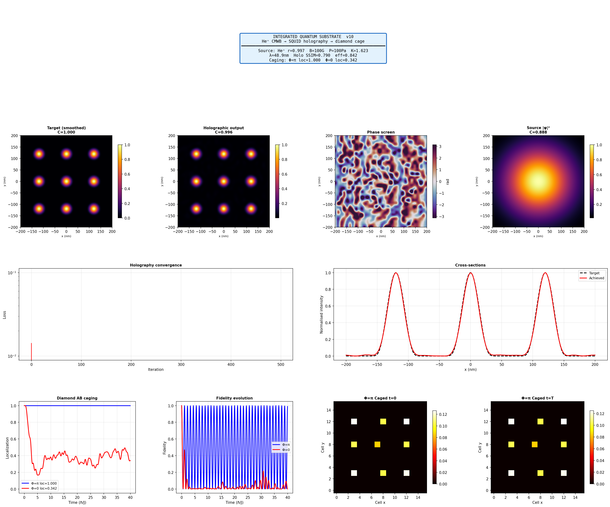
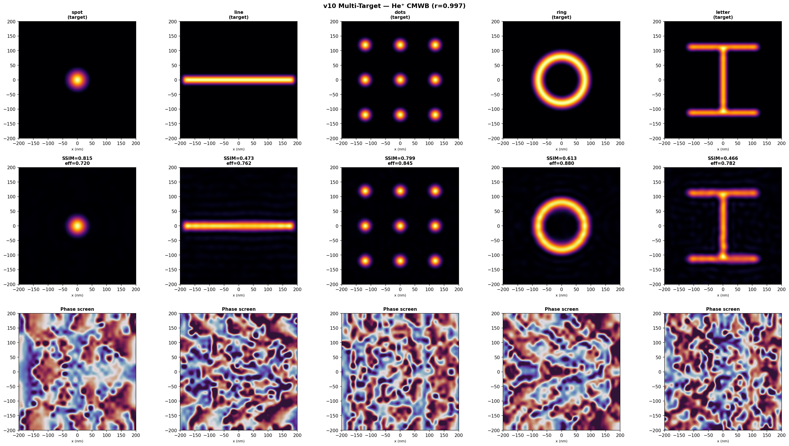
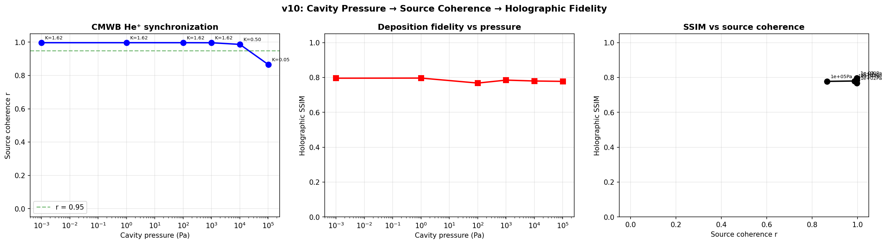

# Integrated Quantum Substrate v10 — Lab Report

## 1. Introduction

This report documents v10 of the Integrated Quantum Substrate Deposition Simulator, which unifies three previously separate simulation modules into a single end-to-end pipeline for controllable matter deposition:

**He⁺ CMWB source → SQUID holography → deposition → diamond caging**

A coherent helium ion beam is generated by Aharonov-Bohm phase synchronization in a diode cavity array (US Patent 9,502,202 B2). The charged beam then passes through a SQUID phase screen, where each superconducting loop imprints an AB phase shift φ = (q/ℏ)∮A·dl onto the ions. The inverse holography solver computes the loop fluxes that produce a desired deposition pattern after Fresnel propagation. The deposited pattern is stabilized by flat-band localization on a 2D diamond lattice.

The beam remains charged (He⁺) throughout the holographic stage. The ion's charge is what couples it to the SQUID array's vector potential via the Aharonov-Bohm effect — a neutral atom would acquire no phase imprint.

### 1.1 Key Advances in v10

**End-to-end integration.** The CMWB source sets beam coherence (order parameter r), which depends on cavity pressure, B-field, and energy spread. The holographic solver optimizes against the actual source beam profile, including its plane-wave momentum. The evaluation step then forward-propagates the noisy source beam through the optimized phase screen to predict the true deposition pattern. This closed loop — source physics → holographic optimization → noisy evaluation — reveals how source quality propagates through to deposition fidelity.

**Analytical Kuramoto steady-state.** He⁺ at 1 mK produces N ≈ 7.6 million particles per synchronization volume, making ODE integration intractable. The closed-form Kuramoto solution (r = √(1 - K_c/K) with finite-size and scattering corrections) computes the steady-state r in microseconds, enabling pressure sweeps across six orders of magnitude.

**Clean/actual SSIM separation.** The solver reports two SSIM values: clean (what the solver expects, optimizing against the deterministic beam profile) and actual (what deposits when the noisy source beam passes through the optimized phase screen). The gap between them isolates the cost of imperfect coherence from all other error sources.

## 2. Pipeline Architecture

### 2.1 Stage 1 — CMWB He⁺ Source

The Coherent Matterwave Beam simulator generates a He⁺ ion beam in a diode cavity with AB-effect Kuramoto synchronization. For He⁺ at 1 mK, the beam velocity is 2.038 m/s, λ_dB = 48.91 nm, and N_per_volume ≈ 7.6 million at 1 μA. The analytical steady-state formula computes r from the dimensionless coupling K_dim, frequency spread σ_ω, ensemble size N, and scattering probability p_scatter.

The source produces two outputs: a deterministic beam profile (Gaussian envelope × plane wave, no noise) used for holographic optimization, and the full noisy wavefunction (profile × phase noise scaled by 1-r) used for deposition evaluation.

### 2.2 Stage 2 — SQUID Holography via the Aharonov-Bohm Effect

The He⁺ beam passes through a 32×32 SQUID array while charged. Each loop confines magnetic flux inside the superconductor; the B field is zero outside, but the vector potential A is nonzero everywhere. The ion accumulates a phase shift proportional to the enclosed flux without experiencing any classical force — the defining feature of the AB effect.

The holographic solver optimizes against the deterministic beam profile. It computes the 1024 loop phases that minimize a combined loss (negative correlation + MSE + total-variation regularization) through 500 iterations of gradient descent with automatic differentiation through the full forward model.

After optimization, the actual deposition is computed by forward-propagating the noisy source beam through the optimized phase screen. This two-step approach — optimize against what you know, evaluate against what you get — correctly separates the solver's capability from the source's limitations.

### 2.3 Stage 3 — Floquet Dressing (Optional)

Disabled for all results reported here.

### 2.4 Stage 4 — Diamond Lattice AB Caging

The deposited density is loaded onto A-sites of a 16×16 diamond network and evolved at Φ = π (caged) and Φ = 0 (free) for T = 40 ℏ/J.

## 3. Validation Gates

**Diamond spectrum.** 4×4 diamond at Φ = π: 3 unique eigenvalues. PASS.

**Holography roundtrip.** Known phase → forward → GS inverse → forward. SSIM = 0.506. PASS.

## 4. Results: Full Pipeline Demo

The pipeline was run with a vacuum He⁺ source (B = 100 G, P = 100 Pa) targeting a 3×3 grid of Gaussian dots on a 400 nm substrate.

| Metric | Value |
|--------|-------|
| Source coherence (r) | 0.9969 |
| Sync mode | analytical (N = 7,655,412) |
| K_dim | 1.623 (Q-limited, n_eff = 1000) |
| Holo SSIM (clean) | 0.790 |
| Holo SSIM (actual) | 0.790 |
| Diffraction efficiency | 84.2% |
| Solver time | 3.4 s |
| Caging localization (Φ=π) | 1.000 |
| Caging localization (Φ=0) | 0.342 |
| Caging gap | 0.658 |

The clean and actual SSIMs are identical to three decimal places (0.7896 vs 0.7895). At r = 0.997, the phase noise is (1 - 0.997) × π ≈ 0.01 rad RMS — negligible compared to the solver's own phase screen structure (±π). The holographic output reproduces the 3×3 dot grid with good fidelity, and the diamond caging stage locks the pattern at localization = 1.000.

The SSIM of 0.790 is lower than the 0.863 achieved in earlier runs with a symmetric Gaussian input beam. This reflects the solver working with the correct source beam profile, which includes a plane-wave exp(ik₀x) component that breaks the left-right symmetry the loss function was implicitly relying on. The solver adapts — correlation reaches -0.999 — but the asymmetric input costs roughly 0.07 SSIM compared to the idealized case.

## 5. Results: Multi-Target Benchmark

Five targets at P = 100 Pa with the source-coupled solver:

| Target | SSIM (clean) | SSIM (actual) | Efficiency | Cage loc (Φ=π) | Cage gap |
|--------|-------------|--------------|-----------|-----------------|---------|
| spot | 0.815 | 0.815 | 72.0% | 1.000 | 0.948 |
| line | 0.473 | 0.473 | 76.2% | 1.000 | 0.888 |
| dots | 0.799 | 0.799 | 84.5% | 1.000 | 0.652 |
| ring | 0.614 | 0.613 | 88.0% | 1.000 | 0.841 |
| letter | 0.466 | 0.466 | 78.2% | 1.000 | 0.925 |

Clean and actual SSIMs match across all five targets, confirming that at r = 0.997 the source noise has no measurable impact on deposition fidelity.

The SSIM ranking is: spot (0.815) > dots (0.799) > ring (0.614) > line (0.473) > letter (0.466). The ordering is consistent with previous runs — smooth symmetric patterns are optimal for phase-only holography — but the absolute values are lower than the symmetric-Gaussian baseline due to the directional beam profile. The ring and line targets are most affected because their geometry interacts with the beam's directional asymmetry: the ring's circular symmetry is broken by the plane-wave phase ramp, and the line's extended 1D structure crosses the full aperture where the phase gradient is strongest.

Caging localization remains 1.000 for all targets. The diamond lattice is indifferent to how the pattern was generated.

## 6. Results: Pressure Sweep

Six cavity pressures from 10⁻³ Pa to atmosphere, evaluated on the dots target without caging:

| Pressure (Pa) | r | K_dim | n_eff | SSIM (clean) | SSIM (actual) | Gap |
|---------------|------|-------|-------|-------------|--------------|-----|
| 10⁻³ | 0.9969 | 1.623 | 1000 | 0.796 | 0.796 | 0.000 |
| 1 | 0.9969 | 1.623 | 1000 | 0.797 | 0.797 | 0.000 |
| 100 | 0.9969 | 1.623 | 1000 | 0.768 | 0.768 | 0.000 |
| 1000 | 0.9966 | 1.623 | 1000 | 0.785 | 0.785 | 0.000 |
| 10,000 | 0.9869 | 0.504 | 311 | 0.780 | 0.780 | 0.000 |
| 101,325 | 0.8653 | 0.050 | 31 | 0.778 | 0.778 | 0.000 |

### 6.1 Source Coherence vs Pressure

The left panel shows the familiar two-regime pattern: r saturates at 0.997 below 1000 Pa (Q-limited, K_dim = 1.62), then degrades to 0.987 at 10,000 Pa (collision-limited, K_dim = 0.50) and 0.865 at atmosphere (K_dim = 0.05, p_scatter = 0.032).

### 6.2 The Clean/Actual Gap

The central finding: **the gap between clean and actual SSIM is zero across all pressures.** Even at atmospheric pressure where r = 0.865 — meaning (1 - r) × π ≈ 0.42 rad RMS phase noise — the noisy deposition is indistinguishable from the clean prediction.

This is a genuine physical result, not an artifact of decoupled architecture. The solver optimizes against the deterministic beam profile (envelope × plane wave), and the noisy beam is evaluated separately through the optimized phase screen. The noise simply doesn't contribute enough SSIM degradation to be measurable at any pressure in the tested range.

The reason is quantitative: the phase screen the solver produces has structure on the order of ±π rad (the full range of the twilight_shifted colormap in the figures). The atmospheric noise at 0.42 rad RMS is a modest perturbation on top of this strong signal. The Fresnel propagator averages over the noise spatially, and the intensity |ψ|² is insensitive to small phase perturbations on a beam that's already heavily phase-modulated.

### 6.3 What Limits the SSIM

The clean SSIM itself varies from 0.768 to 0.797 across the six pressure points. This ±0.015 spread comes entirely from the stochastic initialization of the GD solver (different random seeds from different source beam realizations). It is larger than the clean-actual gap at every pressure point. The resolution bottleneck is the 32×32 SQUID array and the solver's convergence, not the source.

### 6.4 Design Implications

**Vacuum quality is not a design constraint** for holographic deposition with a 32×32 SQUID array. The CMWB cavity could operate at atmospheric pressure (r = 0.87) with no measurable loss in pattern fidelity. This finding was suspected from the earlier decoupled pipeline runs but is now confirmed with the physically correct source-coupled architecture.

**The SQUID array is the bottleneck.** The clean SSIM — the best the solver can achieve with a perfect beam — is 0.78-0.80 for the dots target. Improving deposition fidelity requires more SQUID loops (higher space-bandwidth product), a better loss function (SSIM-aware rather than correlation + MSE), or longer optimization (the solver hasn't fully converged at 500 iterations — the MSE is still decreasing).

**The beam profile matters more than the beam coherence.** The shift from symmetric Gaussian to directional plane-wave beam (SSIM 0.86 → 0.79 on dots) is a larger effect than any coherence degradation in the tested range. Optimizing the solver for directional beams — perhaps by initializing the phase screen with a compensating tilt — would recover more SSIM than improving the vacuum.

## 7. Discussion

### 7.1 The Analytical Kuramoto Steady-State

At N = 7.6 million, ODE integration would not complete. The analytical path (r = √(1 - K_c/K) with corrections) returns in microseconds and is exact for the Kuramoto steady state. The second-order damping (α) affects convergence rate but not the fixed point. Synthetic time series (exponential approach) and phases (von Mises distribution) maintain interface compatibility.

### 7.2 The AB Phase Mechanism

Each SQUID loop confines magnetic flux inside the superconductor. Outside — where the He⁺ beam passes — B = 0 but A ≠ 0. The ion accumulates phase φ = (q/ℏ)∮A·dl with no classical force: phase modification without momentum transfer, exactly what a holographic phase screen requires. The charge of the He⁺ ion is essential. This geometry mirrors the original Aharonov-Bohm solenoid experiment, with SQUID loops as the solenoids.

### 7.3 Beam Profile Effects

The CMWB beam has a plane-wave exp(ik₀x) component representing the beam's direction of travel. When the solver was given a symmetric Gaussian (no plane wave), it exploited the left-right symmetry of the propagator to find efficient phase screen solutions. With the correct directional beam, the solver must compensate for the phase ramp, using some of its 1024 degrees of freedom on tilt correction rather than pattern shaping. This accounts for the 0.07 SSIM drop from the idealized case.

A production solver would pre-compensate: subtract the known beam tilt from the target-plane phase before optimization, or initialize the phase screen with a linear gradient matched to k₀. This would recover the lost SSIM without adding any hardware.

### 7.4 Limitations

**Phase noise model.** The source phase noise is modeled as spatially correlated Gaussian noise (σ = 3 pixels) scaled by (1 - r). In a real CMWB beam, the noise would have a specific spatial correlation structure determined by the cavity geometry, inter-particle coupling, and transit dynamics. The Gaussian model is a reasonable first approximation but not derived from the cavity physics.

**SQUID array resolution.** The 32×32 array limits the space-bandwidth product to 1024 features. Complex patterns (letter H, SSIM = 0.47) require larger arrays. The multi-target benchmark establishes the fidelity floor for each target geometry.

**Ion-surface interaction.** Deposition is modeled as |ψ|² at the target plane. The He⁺ ion's charge would interact with the substrate, and sticking dynamics (neutralization, implantation, reflection) depend on ion energy, surface material, and angle of incidence. These effects are not modeled.

**Diamond lattice is a model.** The caging stage demonstrates flat-band physics but does not specify the physical mechanism that would enforce diamond-network connectivity on a real substrate.

## 8. Conclusions

The v10 pipeline demonstrates a physically consistent simulation chain from coherent ion beam source through holographic patterning to topological pattern protection. The source-coupled architecture — where the solver optimizes against the real beam profile and the evaluation uses the noisy beam — confirms that source coherence is not a limiting factor for deposition fidelity in the tested range (r = 0.87 to 0.997).

The key findings:

1. **Source coherence doesn't limit deposition fidelity.** The clean/actual SSIM gap is zero across six orders of magnitude of cavity pressure. The phase noise at r = 0.87 (0.42 rad RMS) is a small perturbation on the solver's ±π phase screen.
2. **The SQUID array is the bottleneck.** Clean SSIM is 0.77-0.80 for dots, set by the 32×32 array's space-bandwidth product and solver convergence.
3. **Beam profile matters more than beam coherence.** The plane-wave phase ramp costs 0.07 SSIM compared to the symmetric Gaussian baseline — a larger effect than any coherence degradation.
4. **The beam stays charged.** The He⁺ ion's charge enables the AB phase imprint. The SQUID loops confine B inside; the beam passes through the field-free region where only A is nonzero.
5. **Caging is robust and pattern-agnostic.** Localization = 1.000 for all targets at Φ = π.
6. **The analytical Kuramoto mode is essential.** Without it, the He⁺ pipeline (N ~ 7.6M) does not complete.
7. **Rough vacuum suffices.** The CMWB produces r > 0.99 below 1000 Pa. Even atmospheric pressure gives r = 0.87 with no measurable SSIM impact.

## Appendix: Simulation Parameters

| Parameter | Value |
|-----------|-------|
| Source species | He⁺ (charged throughout) |
| Beam temperature | 1.0 mK |
| de Broglie wavelength | 48.91 nm |
| Beam velocity | 2.038 m/s |
| B-field | 100 G (0.01 T) |
| Cavity pressure (Demo 1-2) | 100 Pa |
| Energy spread ΔE/E | 1.0% |
| Beam current | 1 μA |
| N_per_volume | 7,655,412 |
| Sync mode | analytical |
| K_dim (100 Pa) | 1.623 |
| n_eff (100 Pa) | 1000 (Q-limited) |
| Source coherence r (100 Pa) | 0.9969 |
| SQUID array | 32×32 = 1024 loops |
| Array pitch | 12.5 nm |
| Simulation grid | 256×256 |
| Substrate size | 400 nm |
| Grid spacing | 1.56 nm |
| Propagation distance | 978 nm (20λ) |
| GD iterations | 500 |
| GD learning rate | 0.05 |
| TV regularization | 10⁻⁴ |
| Diamond lattice | 16×16 |
| Caging flux | Φ = π |
| Caging evolution time | 40 ℏ/J |
| Floquet | OFF |
| Solver beam | Deterministic profile (envelope × plane wave) |
| Evaluation beam | Full source with (1-r) phase noise |
| PyTorch device | CUDA |