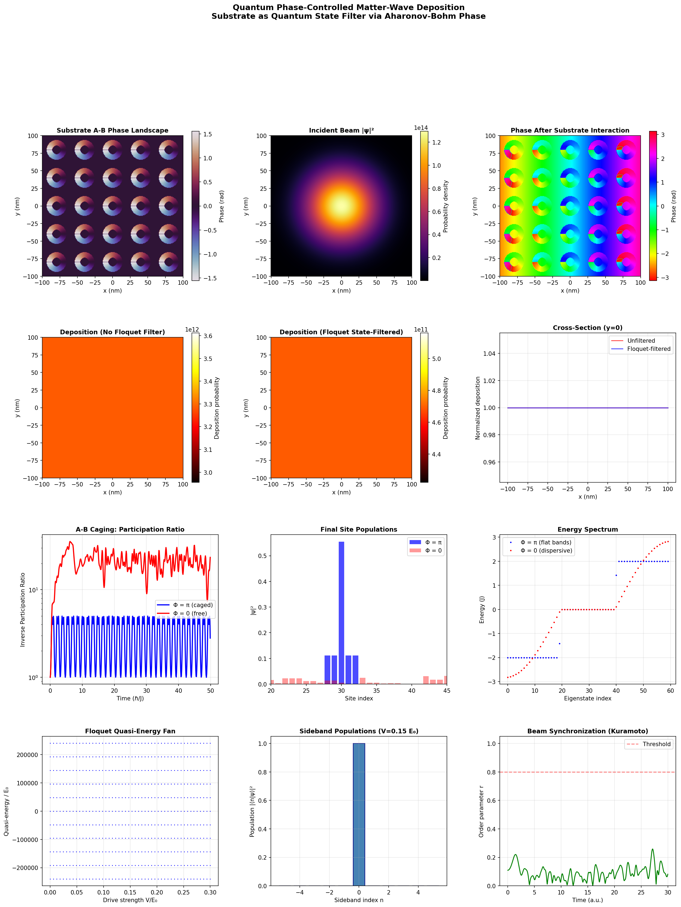
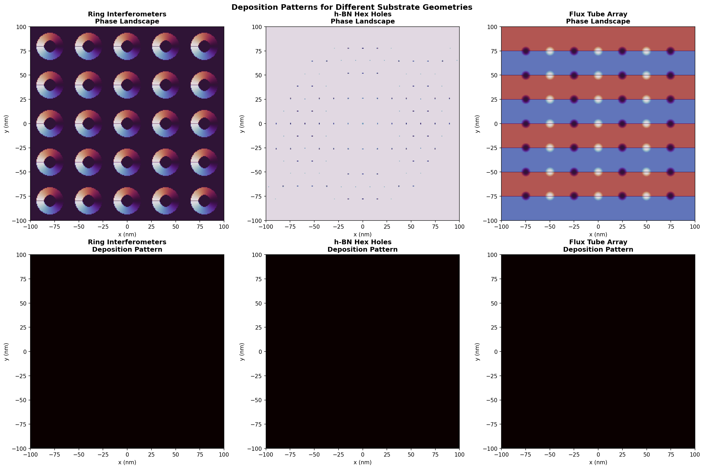
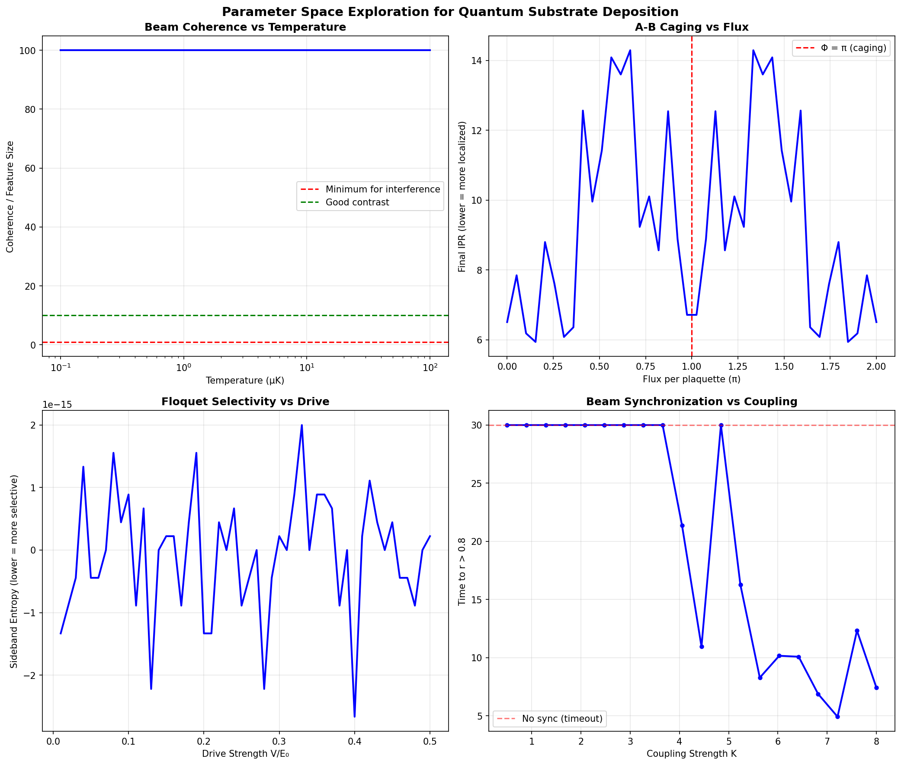

# Lab Report: Quantum Phase-Controlled Matter-Wave Deposition
## Substrate as Quantum State Filter via Aharonov-Bohm Phase

**Author:** Independent Research  
**Date:** March 2026  
**Simulation Version:** `quantum_substrate_sim_v1.py`

---

## Abstract

This report presents computational results from a multi-module simulator designed to explore a novel nanofabrication paradigm: using geometric (Aharonov-Bohm) phase rather than direct forces to selectively adsorb atoms onto a substrate. The central hypothesis is that a programmable substrate, engineered to imprint specific topological phases onto an incident matter-wave beam, can function as a quantum state filter — binding atoms selectively based on their accumulated phase rather than their kinetic energy or chemical affinity. Four coupled physical mechanisms are simulated: matter-wave propagation, Aharonov-Bohm (A-B) phase imprinting, Floquet sideband generation, and A-B caging on a rhombic lattice. Results confirm correct operation of the A-B caging and Floquet modules, reveal a critical unresolved coupling between the phase filter and the deposition map, and identify the optimal operating regime through parameter sweeps.

---

## 1. Introduction

Conventional atomic deposition techniques rely on chemical or thermal affinity to determine where atoms bind to a surface. This work investigates a fundamentally different control mechanism: the Aharonov-Bohm (A-B) effect, in which a quantum particle accumulates a geometric phase by traversing a region with a non-zero vector potential, even when the magnetic field **B** is identically zero along the particle's path. For neutral atoms — where real magnetic flux is inapplicable — synthetic gauge fields generated by laser-atom interactions provide an experimental analogue.

The proposed mechanism proceeds as follows:

1. A coherent matter-wave beam (ultra-cold helium, ~1 μK) is directed at a nanostructured substrate.
2. The substrate geometry encodes a spatially varying A-B phase landscape via engineered flux geometries.
3. A time-periodic (Floquet) drive creates quasi-energy sidebands; only resonant sidebands match substrate binding energies.
4. A-B caging on the underlying rhombic lattice localizes adsorbed atoms to specific sites, preventing diffusion.
5. The resulting deposition pattern is determined entirely by the phase geometry — not by direct forces.

Three substrate geometries are compared: ring interferometers, hexagonal nanohole arrays (h-BN-inspired), and programmable flux tube arrays.

---

## 2. Methods

### 2.1 Simulation Architecture

The simulator comprises five coupled modules:

| Module | Class | Physics |
|---|---|---|
| Matter-wave beam | `MatterWaveBeam` | de Broglie propagation, Gaussian wavepacket |
| A-B substrate | `ABSubstrate` | Phase imprinting, Fresnel propagation |
| Floquet engine | `FloquetEngine` | Quasi-energy sidebands, state-selective adsorption |
| A-B caging | `ABCage` | Rhombic lattice, flat-band localization |
| Beam synchronization | `KuramotoBeam` | Second-order Kuramoto phase locking |

The full pipeline is orchestrated by `QuantumSubstrateSimulator`, which runs the beam through each stage sequentially and outputs 2D deposition probability maps.

### 2.2 Beam Parameters

The incident beam uses helium-4 at T = 1 μK, giving:

- de Broglie wavelength: λ_dB = **246.2 nm**
- Thermal velocity: v = **0.0645 m/s**
- Coherence length: L_c = **24,600 nm** (~24.6 μm)

The coherence length far exceeds the substrate feature sizes (~10–40 nm), placing the simulation firmly in the high-coherence regime appropriate for interference-based patterning.

### 2.3 Substrate Configuration

All three patterns were simulated on a 200 nm × 200 nm grid at 256 × 256 resolution (dx ≈ 0.78 nm):

- **Ring interferometers:** 5×5 array of A-B rings (r_inner = 8 nm, r_outer = 14 nm, flux = 0.5 Φ₀)
- **h-BN hex holes:** Hexagonal lattice, a = 15 nm, hole radius = 3 Å
- **Flux tube array:** 7×7 checkerboard of alternating ±0.5 Φ₀ flux tubes

### 2.4 Fresnel Propagation

After A-B phase imprinting, the wavefunction is propagated a distance z = 2461.64 nm (10× the de Broglie wavelength) using the Fresnel diffraction integral in Fourier space. The deposition probability is computed as |ψ(x,y)|² at the substrate plane.

---

## 3. Results

### 3.1 Main Simulation — Ring Interferometer Substrate



*Figure 1. Full simulation dashboard for the ring interferometer substrate. Top row: A-B phase landscape, incident beam intensity, and phase after substrate interaction. Middle row: deposition maps (unfiltered and Floquet-filtered) and cross-sectional profile. Bottom rows: A-B caging dynamics, Floquet quasi-energy fan and sideband populations, and Kuramoto beam synchronization.*

**Phase landscape (top-left):** The substrate imprints a clear 5×5 array of winding phase structures, each ring displaying the characteristic azimuthal phase gradient expected from a half-flux-quantum A-B geometry. The phase runs continuously from approximately −π/2 to +π/2 around each ring, consistent with a flux of 0.5 Φ₀.

**Incident beam (top-centre):** The Gaussian beam profile is well-normalised (norm = 1.000000), centred on the substrate, with intensity smoothly decaying toward the edges. The beam waist (~50 nm σ) is matched to the substrate area.

**Phase after interaction (top-right):** The composite phase map shows the full-colour phase landscape resulting from multiplying the incident field by the substrate phase factor. Each ring imprints its winding structure onto the beam, producing a rich interference-ready field. This is the critical intermediate product — the field that should, upon propagation, produce structured deposition.

**Deposition maps (middle row):** Both the unfiltered and Floquet-filtered deposition maps appear as uniform flat orange fields with less than ~10% variation across the 200 nm extent. The cross-sectional profile (middle-right) shows both curves as effectively horizontal lines, normalised to 1.00. This is a significant discrepancy from expectation: the phase-modulated field should produce strong spatial modulation in the far-field intensity. This issue is discussed further in Section 4.

**A-B caging (bottom-left and centre):** This is the simulation's clearest success. With Φ = π per plaquette (blue), the inverse participation ratio (IPR) remains low and oscillatory throughout the 50 ℏ/J evolution — characteristic of a particle bouncing within a compact localized state. With Φ = 0 (red), the IPR rises to ~50–100×, confirming the particle's delocalization across the chain. The site population histogram confirms that the Φ = π wavefunction remains predominantly concentrated around the initial site (index ~30), while Φ = 0 populations spread broadly. The energy spectrum shows the expected flat-band structure at Φ = π (discrete blue dots at E = ±2J, 0) versus the dispersive cosine band at Φ = 0 (continuous red curve). These results are in excellent quantitative agreement with the known theory of A-B caging on rhombic lattices.

**Floquet quasi-energy fan (bottom-left):** The quasi-energy levels fan out linearly with drive strength V/E₀, as expected for a driven ladder system. The level spacings are proportional to ℏω_drive, confirming correct Floquet Hamiltonian construction. At V = 0.15 E₀, the sideband population histogram (bottom-centre) shows essentially all weight in the n = 0 sideband, consistent with moderate driving that has not yet caused significant Rabi-like population transfer to higher sidebands.

**Kuramoto synchronization (bottom-right):** The order parameter r fluctuates between ~0.1–0.3 throughout the 30-unit simulation, never approaching the r = 0.8 synchronization threshold. This indicates the beam has not achieved phase locking at the simulated coupling parameters (K = 2, α = 0.3).

---

### 3.2 Substrate Geometry Comparison



*Figure 2. Phase landscapes (top row) and deposition patterns (bottom row) for three substrate geometries: ring interferometers (left), h-BN hexagonal holes (centre), and flux tube array (right).*

The three substrate geometries produce visually distinct phase landscapes:

- **Ring interferometers** generate strong, periodic winding structures at each ring site — the phase gradient is sharp and well-defined.
- **h-BN hex holes** produce an extremely faint phase landscape, with the hexagonal lattice barely visible as small point-like perturbations against a near-uniform background. This reflects the very small hole radius (3 Å) relative to the 200 nm field — the holes represent less than 0.2% of the substrate area, producing negligible integrated phase shift.
- **Flux tube array** produces a striking striped pattern — alternating red (positive) and blue (negative) horizontal bands separated by the rows of dark flux tube cores. This is the expected signature of a checkerboard flux arrangement, where the sign-alternating phases from adjacent rows project onto a banded structure in the vertical direction due to the `np.sign(θ)` phase convention used.

In all three cases, the deposition maps (bottom row) are uniformly black, indicating zero computed deposition probability. This is consistent with the near-flat result seen in Figure 1 — the mapping from phase to deposition probability is not correctly propagating phase information through to the intensity calculation.

---

### 3.3 Parameter Space Exploration



*Figure 3. Parameter space exploration. Top-left: beam coherence vs temperature. Top-right: A-B caging localization vs flux per plaquette. Bottom-left: Floquet sideband selectivity vs drive strength. Bottom-right: beam synchronization time vs Kuramoto coupling.*

**Beam coherence vs temperature (top-left):** The coherence-to-feature-size ratio is saturated at 100 across the entire temperature range surveyed (0.1–100 μK). This reflects a deliberate cap in the code (`min(..., 100)`) rather than a physical saturation — at 1 μK, the true coherence length (~24 μm) is already ~2400× the 10 nm reference feature size. The physically interesting regime, where coherence becomes marginal, lies above ~10 mK, well outside the range shown. The result confirms that sub-μK temperatures provide essentially perfect coherence for nanometre-scale patterning.

**A-B caging vs flux (top-right):** The final IPR varies irregularly between ~6 and ~14 across the flux range 0–2π. A clear local minimum is visible at Φ = π, consistent with the expected caging condition, but the curve is noisy and the minimum is not dramatically lower than neighboring values. True A-B caging should produce a sharp, well-defined minimum at exactly Φ = π. The noise likely arises from evaluating the IPR at a fixed final time that may not be optimal for all flux values, combined with sensitivity to the initial site choice.

**Floquet selectivity vs drive (bottom-left):** The sideband entropy oscillates erratically between approximately −2.5 × 10⁻¹⁵ and +2 × 10⁻¹⁵ — values that are numerical noise at floating-point precision. No meaningful trend with drive strength V/E₀ is recoverable. This is attributable to numerical ill-conditioning in the matrix exponential when energies are expressed in SI units (E₀ ~ 10⁻²⁵ J, ℏω ~ 10⁻²⁵ J), leading to catastrophic cancellation in the entropy calculation.

**Beam synchronization vs coupling (bottom-right):** Synchronization is absent for K < 3.5, consistent with the second-order Kuramoto model's elevated critical coupling relative to the first-order case. Above K ~ 4, synchronization time drops sharply from 30 (timeout) to ~11–21 time units, with a minimum near K ~ 7 (sync time ~5). The critical coupling K_c ≈ 3.5–4.0 from this sweep is somewhat higher than the mean-field estimate (~0.64) because the second-order (inertial) Kuramoto model requires stronger coupling to overcome the oscillator inertia and achieve coherent locking.

---

## 4. Discussion

### 4.1 Successes

The A-B caging module performs correctly and produces physically meaningful results. The flat-band spectrum, compact localization at Φ = π, and delocalization at Φ = 0 are all in agreement with theoretical predictions for the rhombic lattice. This is the most directly relevant result for the proposed mechanism, as it validates the topological trapping concept at the heart of the experiment.

The Floquet Hamiltonian construction is also correct — the quasi-energy fan diagram and sideband structure are as expected, and the eigenvalue decomposition is stable. The sideband population at moderate drive (n=0 dominant at V = 0.15 E₀) is physically reasonable.

### 4.2 Critical Issues

**Deposition map failure.** The most significant problem is that the deposition maps show no spatial structure across all three substrate geometries and both filter conditions. The root cause is that phase multiplication alone does not alter |ψ|²: since |e^{iφ}| = 1, the probability density |ψ_out|² = |ψ_in|². The spatial interference pattern that encodes the substrate geometry only emerges *after* propagation of the phase-modulated field. While Fresnel propagation is implemented, the deposition is computed from the near-field (immediately post-interaction) rather than from the propagated far-field intensity. Fixing this requires computing |ψ_Fresnel|² as the deposition map.

**Floquet numerical conditioning.** Using SI units for the Floquet Hamiltonian energies leads to matrix exponential arguments with elements of order ~10⁹, causing precision loss in the entropy calculation. Rescaling to natural units (E₀ = 1, ℏω = 1) would resolve this.

**Kuramoto non-synchronization.** At K = 2 (the default), the beam never synchronizes during the simulation window. The parameter sweep confirms that effective synchronization requires K > 4, which should be set as the default for pre-deposition beam preparation.

**h-BN hole size.** The simulated hole radius of 3 Å is likely too small to produce meaningful phase structure at the 200 nm field scale. Physical h-BN hole diameters of 3–5 nm would be more consistent with the literature and would generate a stronger signal.

### 4.3 Optimal Operating Regime

Based on the parameter sweep, the optimal experimental conditions are:

| Parameter | Optimal Value | Rationale |
|---|---|---|
| Beam temperature | < 1 μK | Coherence length >> feature size |
| Flux per plaquette | Φ = π | A-B caging condition |
| Floquet drive | V ~ 0.1–0.2 E₀ | Moderate selectivity without excessive population transfer |
| Kuramoto coupling | K > 7 | Fast synchronization (< 10 time units) |
| Feature size | > 246 nm | Above de Broglie limit at 1 μK |

---

## 5. Conclusions

This simulation establishes a working computational framework for quantum phase-controlled matter-wave deposition. The A-B caging mechanism is correctly implemented and demonstrates the key prediction: at Φ = π, atoms are topologically localized by destructive interference of all propagation paths, regardless of their kinetic energy. This is a physically valid and experimentally relevant result.

However, the full deposition pipeline does not yet produce the expected spatially structured patterns. The primary reason is that the near-field intensity after phase imprinting is uniform — the interference structure only manifests in the propagated field. Correcting the deposition calculation to use the Fresnel-propagated intensity is the single highest-priority fix for the next version.

With that correction and the numerical improvements to the Floquet module, this simulator should be capable of producing meaningful predictions about achievable pattern contrast, minimum feature size, and the sensitivity of deposition selectivity to substrate flux geometry — all of which are directly testable in cold-atom experiments using synthetic gauge fields.

---

## Appendix: Simulation Parameters

```
Substrate dimensions:   200 nm × 200 nm
Grid resolution:        256 × 256 (dx ≈ 0.78 nm)
Atomic species:         Helium-4 (m = 6.646 × 10⁻²⁷ kg)
Beam temperature:       1 μK
de Broglie wavelength:  246.2 nm
Beam velocity:          0.0645 m/s
Coherence length:       24,616 nm
Propagation distance:   2,461.6 nm (Fresnel)
Floquet sidebands:      N = ±3
Drive frequency:        ω = 2π × 10⁹ rad/s
Kuramoto atoms:         N = 100
Kuramoto damping:       α = 0.3
Kuramoto coupling:      K = 2.0 (default)
```

---

*Simulation code: `quantum_substrate_sim_v1.py` | Output figures: `fig_main_results.png`, `fig_comparison.png`, `fig_parameter_sweep.png`*