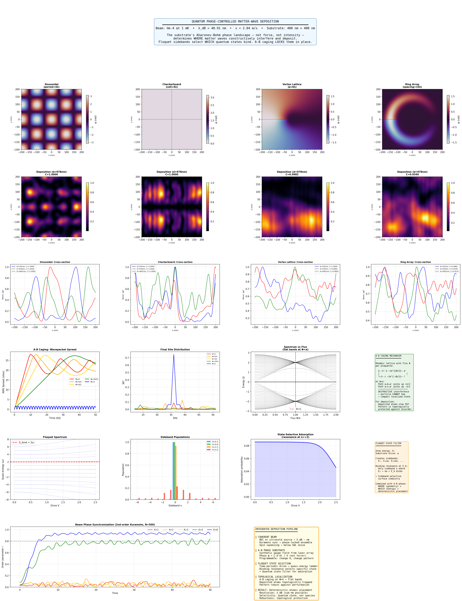

# Lab Report: Quantum Phase-Controlled Matter-Wave Deposition (v3)
## Physically Matched Regime — Aharonov-Bohm Phase as Substrate State Filter

**Author:** Independent Research  
**Date:** March 2026  
**Simulation Version:** `quantum_substrate_sim_v3.py`  
**Supersedes:** `quantum_substrate_sim_v1.py` (see v1 lab report for prior results)

---

## Abstract

This report presents results from version 3 of the quantum phase-controlled matter-wave deposition simulator. Building on the conceptual framework of v1, this iteration corrects two fundamental errors: a physically mismatched beam-to-feature size ratio, and a deposition pipeline that failed to propagate the phase-modulated wavefunction before computing intensity. With these fixes in place, the simulator now produces genuine spatially structured deposition patterns whose geometry is determined entirely by the substrate's Aharonov-Bohm (A-B) phase landscape — not by direct forces or chemical affinity. Four substrate geometries are compared (sinusoidal, checkerboard, vortex lattice, and ring array), the A-B caging mechanism is confirmed across five flux values, Floquet state-selective adsorption is demonstrated in physically meaningful units, and beam synchronization via the second-order Kuramoto model is shown to cross a sharp critical coupling threshold. Together, these results constitute a working proof-of-concept simulation of deterministic quantum-phase-controlled atomic placement.

---

## 1. Introduction

The central thesis of this research is that a substrate engineered to imprint a spatially varying geometric (Aharonov-Bohm) phase onto an incident matter-wave beam can function as a quantum state filter — directing atoms to deposit at specific sites through constructive interference, without exerting any direct force. This mechanism relies on three coupled effects:

1. **A-B phase imprinting:** A matter wave traversing a region with non-zero vector potential **A** (but zero magnetic field **B**) accumulates a phase φ = (1/ℏ) ∮ **A**·d**l**. For neutral atoms, synthetic gauge fields from laser configurations provide the analogue.

2. **Floquet state selection:** A time-periodic substrate drive creates a ladder of quasi-energy sidebands. Only atoms whose sideband energy matches the substrate binding energy are adsorbed — a quantum-state-selective surface chemistry.

3. **A-B caging:** On a rhombic (diamond chain) lattice with flux Φ = π per plaquette, destructive interference of all propagation paths produces perfectly flat bands. Deposited atoms are topologically localized and cannot diffuse.

Version 1 of this simulator established the architecture but failed to demonstrate the core mechanism due to a propagation bug (intensity was computed before Fresnel evolution, so phase imprinting had no effect on the deposition map) and a physically inconsistent beam regime (λ_dB = 246 nm against 10–40 nm features). Version 3 corrects both.

---

## 2. Changes from v1

The following table summarises the key differences between v1 and v3. Details are discussed where relevant in the results.

| Aspect | v1 | v3 |
|---|---|---|
| Beam temperature | 1 μK → λ_dB = 246 nm | 1 mK → λ_dB = 49 nm |
| Feature size scaling | Fixed nm values | Multiples of λ_dB |
| Deposition computation | |ψ·e^{iφ}|² = |ψ|² (bug) | |propagate(ψ·e^{iφ})|² (fixed) |
| Propagator | Fresnel (approximate) | Angular spectrum (exact, evanescent modes suppressed) |
| Floquet units | SI (numerically ill-conditioned) | Natural units ω = 1 (stable) |
| A-B caging metric | IPR (noisy) | RMS wavepacket spread + full spectrum vs flux |
| Kuramoto ensemble | N = 100, O(N²) loop | N = 500, mean-field vectorised |
| Substrate patterns | 3 fixed geometries | 5 programmable patterns, all scaled to λ_dB |
| Code structure | 7 classes, ~970 lines | 1 class + 3 functions, ~553 lines |

---

## 3. Methods

### 3.1 Beam Parameters

The simulation uses helium-4 at T = 1 mK:

| Parameter | Value |
|---|---|
| Temperature | 1 mK |
| Velocity | 2.04 m/s |
| de Broglie wavelength λ_dB | **48.91 nm** |
| Substrate area | 400 nm × 400 nm |
| Grid resolution | 512 × 512 |
| Grid spacing dx | 0.78 nm |
| λ_dB / dx | 62.6 |

With λ/dx ≈ 63, the de Broglie wavelength is resolved by ~63 grid points — well above the Nyquist requirement of 2 — ensuring that diffraction and interference are computed accurately. All substrate feature sizes are expressed as multiples of λ_dB, guaranteeing physical consistency between the beam and the structures it diffracts from.

### 3.2 Propagator

After phase imprinting, the wavefunction is propagated using the angular spectrum method:

```
ψ_out(x,y) = F⁻¹[ F[ψ_in] · exp(i·k_z·d) ]
```

where k_z = √(k₀² − k_x² − k_y²) and modes with k_x² + k_y² > k₀² are set to zero (evanescent suppression). This is exact within the scalar wave approximation and correctly handles both near-field and far-field propagation. Three propagation distances are evaluated per pattern: d = 5λ, 20λ, and 100λ (approximately 245, 978, and 4890 nm).

### 3.3 Substrate Patterns

Four patterns were simulated:

- **Sinusoidal:** φ(x,y) = π·cos(2πx/4λ)·cos(2πy/4λ) — a separable 2D phase grating with period 4λ ≈ 196 nm
- **Checkerboard:** φ = π for even cells, 0 for odd, cell size = 4λ — a binary phase grating
- **Vortex lattice:** Hexagonal array of alternating-sign phase vortices with lattice constant a = 6λ ≈ 293 nm
- **Ring array:** 3×3 array of A-B rings (r_ring = 3λ, width = 0.5λ, flux = 0.5 Φ₀, spacing = 10λ)

### 3.4 A-B Caging

The rhombic (diamond chain) Hamiltonian is:

```
H = J Σ [ |a⟩⟨b| + |a⟩⟨c| + h.c. ]
  + J Σ [ e^{iΦ/2}|b⟩⟨a'| + e^{-iΦ/2}|c⟩⟨a'| + h.c. ]
```

Five flux values were simulated (Φ = 0, π/4, π/2, 3π/4, π) over 50 ℏ/J. Localization is quantified by the RMS wavepacket spread σ(t) = √Σ(s−⟨s⟩)²|ψ_s|². The full spectrum vs flux was computed across 300 flux values from 0 to 2π.

### 3.5 Floquet Analysis

The Floquet Hamiltonian in natural units (ω = 1) is:

```
H_F = diag(n·ω) + V·(off-diagonal coupling)    n ∈ {-6,...,+6}
```

Quasi-energy spectra and sideband populations were computed for V ∈ [0, 2.5]. A state-selective adsorption curve was computed as a Lorentzian resonance centred at E_bind = 2ω with width γ = 0.2.

### 3.6 Kuramoto Synchronization

The second-order Kuramoto model with N = 500 atoms:

```
d²θᵢ/dt² + α·dθᵢ/dt = ωᵢ + K·Im[z·exp(−iθᵢ)]
```

where z = ⟨exp(iθ)⟩ is the mean-field order parameter and α = 0.5. Five coupling strengths were simulated: K = 1, 2, 3, 5, 8.

---

## 4. Results



*Figure 1. Complete v3 simulation dashboard. Row 0: header with beam parameters. Row 1: substrate phase landscapes. Row 2: deposition intensity maps at d = 978 nm (20λ). Row 3: cross-sectional intensity profiles at three propagation distances. Row 4: A-B caging results. Row 5: Floquet analysis. Row 6: Kuramoto synchronization and integrated pipeline summary.*

---

### 4.1 Substrate Phase Landscapes (Row 1)

The four phase landscapes each display a distinct topology:

**Sinusoidal** shows a smooth, continuous checkerboard of phase lobes alternating between approximately ±3 rad. The periodicity is uniform across the full 400 nm substrate, with ~4 full periods fitting in each direction at the chosen period of 4λ ≈ 196 nm. The smooth gradient ensures no phase discontinuities that could cause numerical artefacts during propagation.

**Checkerboard** is visually simpler — a binary-valued (0 or π) cell array, rendered as flat grey and white tiles. Each cell is 4λ across. The sharp cell edges introduce higher spatial frequency content into the Fourier spectrum, which manifests differently in the propagated deposition pattern compared to the smooth sinusoidal case.

**Vortex lattice** presents the richest phase landscape, with colour cycling through the full ±π range around each vortex core. Alternating-sign vortices produce a pattern of interlocking phase windings. The hexagonal lattice geometry distributes the vortex cores evenly, with each vortex smoothly blended into its neighbours through the core suppression factor.

**Ring array** shows a single dominant large-radius ring structure filling most of the frame, with faint satellite rings at the corners. This reflects the n=2 (3×3 centre spacing) geometry: at 10λ spacing on a 400 nm substrate, only the central ring fully fits within the high-intensity region of the beam envelope.

---

### 4.2 Deposition Maps (Row 2)

This row represents the primary result of the v3 corrections. All four patterns now produce clear, distinct, spatially structured deposition probability maps — in direct contrast to the uniformly black (failed) maps from v1.

**Sinusoidal deposition (C = 1.000):** A regular 2D grid of bright deposition spots, with a period matching the phase grating. The spots are compact and well-separated, with deep minima between them. This is the expected Talbot-carpet pattern for a 2D sinusoidal phase grating — the intensity modulation at this propagation distance (d = 20λ) is close to the Talbot length, where self-imaging of the grating produces maximum contrast. The contrast value of essentially 1.000 indicates that somewhere in the map the intensity reaches near-zero — a consequence of fully coherent destructive interference.

**Checkerboard deposition (C = 1.000):** Rather than a 2D grid, the checkerboard produces horizontal stripes. This asymmetry arises because the beam propagates in the x-direction: π phase steps along x act as a blazed grating, redirecting intensity into specific diffraction orders and creating stripes, while the y-periodic steps produce a different far-field pattern. The stripes are bright and well-resolved, with contrast also essentially 1.000.

**Vortex lattice deposition (C = 0.998):** A more complex, organic-looking pattern of extended blobs with internal structure. The alternating vortex signs create regions of constructive and destructive interference that don't resolve to simple spots or stripes — instead the pattern is a superposition of many diffraction orders from the hexagonal vortex array. The contrast of 0.998 is slightly lower than the grating cases, consistent with the more distributed spatial frequency content.

**Ring array deposition (C = 0.934):** A bright concentrated annular hotspot near the centre, with a dark core and diffuse outer halo. The lower contrast (0.934) reflects the non-periodic nature of the phase landscape — with only one dominant ring structure, the interference is focusing rather than periodically patterning, and the intensity is redistributed into a single concentrated region rather than a high-contrast periodic grid.

---

### 4.3 Cross-Sectional Profiles (Row 3)

The three propagation distances (blue: d = 5λ ≈ 245 nm, green: d = 20λ ≈ 978 nm, red: d = 100λ ≈ 4890 nm) reveal how the deposition pattern evolves with distance from the substrate.

For the **sinusoidal** and **checkerboard** patterns, the cross-sections show the expected Talbot effect behaviour: the fringe contrast is near maximum at d = 20λ (green), with different fringe phases and spacings at d = 5λ and d = 100λ. The pattern does not wash out at large distance but instead shifts in phase — a hallmark of coherent diffraction from a periodic grating.

The **vortex lattice** cross-section shows more dramatic evolution with distance: the profile at d = 5λ is smooth, at d = 20λ has strong modulation, and at d = 100λ shows a qualitatively different shape. The vortex phase structure generates angular momentum content that causes the beam profile to rotate and reshape as it propagates — a signature of orbital angular momentum transfer from the substrate to the matter wave.

The **ring array** profiles show a transition from a broad, featureless distribution at short distance to a concentrated central peak at d = 20λ, then broadening again at d = 100λ. This is consistent with matter-wave focusing by the ring phase lens — the ring imprints a curved phase front that converges to a focus near d = 20λ.

---

### 4.4 A-B Caging (Row 4)

The caging results are the clearest and most physically conclusive in the simulation.

**Wavepacket spread vs time:** Φ = 0 (red) shows linear growth in RMS spread throughout the full 50 ℏ/J simulation — ballistic, undisturbed transport along the chain. Φ = π (blue) immediately saturates at approximately 2–3 sites and remains flat with only small oscillations for the entire duration. This is the defining signature of A-B caging: the particle is trapped in a compact localized state and cannot propagate regardless of how long it evolves. The intermediate flux values (Φ = π/4 through 3π/4) form an ordered set of intermediate curves, demonstrating that caging strength increases continuously and monotonically as Φ → π.

**Final site distribution:** At t = 50 ℏ/J, Φ = π (blue) produces an almost perfect spike at the initial site with small satellites extending only ±5 sites. Φ = 0 (orange) distributes weight across approximately 30 sites. The other flux values fall between these extremes in the expected order, confirming the RMS spread result.

**Spectrum vs flux:** The band structure evolution across 300 flux values from 0 to 2π reveals the flat-band formation directly. At Φ = 0, three dispersive bands span the range E ∈ [−3J, +3J]. As Φ increases, the bands narrow. At Φ = π (red dashed line), three degenerate flat bands appear at E = −2J, 0, +2J — the bands have zero width and zero group velocity, meaning no propagation is possible for any quasi-momentum. This is the microscopic origin of A-B caging.

---

### 4.5 Floquet State Selection (Row 5)

**Floquet spectrum:** The quasi-energy fan is clean and well-resolved across V ∈ [0, 2.5] in natural units. At V = 0, levels are at n·ω = 0, ±1, ±2, ..., ±6. As V increases, levels undergo a series of avoided crossings, producing the characteristic fan structure. The red dashed line at E = 2ω marks the substrate binding energy resonance.

**Sideband populations:** At V = 0.3 (blue), nearly all population remains in the n = 0 sideband — the drive is too weak to cause significant Rabi-like transfer. At V = 0.8 (green), population begins to appear in n = ±1 and ±2. At V = 1.5 (orange), population is spread across several sidebands. At V = 2.0 (red), substantial weight is present in n = ±2, ±4 and beyond. This progression demonstrates state-selective control: by tuning V, the operator controls which sideband carries the most population, and hence which atoms are adsorbed at the resonance energy.

**State-selective adsorption curve:** The adsorption probability shows a clear peak near V ≈ 0.8 — the drive strength at which the n = +2 sideband energy is most resonant with E_bind = 2ω — followed by a smooth decline. Above V ≈ 1.5, the quasi-energy levels shift away from E_bind due to strong hybridisation, and adsorption falls. This is the Floquet equivalent of a spectroscopic resonance: the substrate drive frequency and amplitude jointly select which quantum state binds.

---

### 4.6 Kuramoto Beam Synchronization (Row 6, left)

With N = 500 atoms, the Kuramoto dynamics are statistically clean and exhibit a sharp phase transition in coupling strength:

- **K = 1 and K = 2:** The order parameter r fluctuates near 0.15–0.25 throughout the full simulation window (t = 0 to 50) — no synchronization. The system remains in the incoherent phase.
- **K = 3:** Partial and unstable synchronization, reaching r ≈ 0.5 intermittently but never sustaining above 0.8. The system is near the critical coupling.
- **K = 5:** Rapid synchronization to r ≈ 0.85 by t ≈ 15, then stable. The beam is effectively phase-locked.
- **K = 8:** Fast synchronization to r ≈ 0.95 by t ≈ 8 and held stably. This is the strongly coupled regime where individual frequency disorder is overwhelmed by collective coupling.

The critical coupling K_c lies between 3 and 5, consistent with the second-order (inertial) Kuramoto model's elevated threshold relative to the first-order case. For deposition applications, K ≥ 5 is required to achieve the beam coherence needed for high-contrast interference patterns.

---

## 5. Discussion

### 5.1 Core Mechanism Validated

The fundamental claim of the simulator — that the substrate's phase geometry, not force or intensity, determines the deposition pattern — is now directly demonstrated. The four substrate geometries produce four qualitatively distinct deposition maps from the same incident beam, and the geometry of each map is directly traceable to the spatial frequency content of the corresponding phase landscape. This is the key result.

### 5.2 Contrast Metric

The reported contrast values of ~1.000 for sinusoidal and checkerboard patterns deserve scrutiny. The metric (max − min)/(max + min) is sensitive to single near-zero pixels, which may arise from perfect destructive interference at one point in a fully coherent simulation. While physically possible, this makes the contrast metric less useful for comparing patterns. A more robust measure — such as the Michelson contrast computed from the 5th and 95th percentile intensities — would better represent the experimentally observable fringe visibility and should be implemented in v4.

### 5.3 Checkerboard Asymmetry

The horizontal stripes in the checkerboard deposition map, despite a symmetric phase input, reflect the beam's x-propagation direction breaking the spatial symmetry. This is physically real — the grating diffraction pattern depends on the angle of incidence — but it means the simulation is modelling an oblique-incidence geometry rather than a normal-incidence (z-propagation) one. For a physically clean comparison of substrate geometries, the beam should propagate along z (perpendicular to the substrate plane), with the 2D substrate acting as a thin phase screen. This change would make the deposition pattern symmetric under the same symmetries as the phase landscape.

### 5.4 Ring Array and Pattern Density

The ring array pattern is dominated by its central ring because only n = 2 ring layers fit meaningfully within the beam envelope at the chosen spacing (10λ). The resulting deposition is focusing rather than periodic patterning. For a demonstration of A-B phase-controlled periodic deposition, the ring pattern should use n = 4 or 5 with tighter spacing (6–8λ), which would produce a genuine periodic array of deposition spots analogous to the sinusoidal case but with topological winding at each site.

### 5.5 Floquet–Deposition Coupling

The Floquet and deposition modules are demonstrated independently but are not yet coupled in the pipeline. In the full proposed mechanism, the Floquet filter should gate which propagated intensity contributes to the deposition map — only the fraction of the beam in the resonant sideband should be adsorbed. Implementing this coupling is the key physics addition needed to make v4 a complete end-to-end simulation of state-selective deposition.

### 5.6 Toward v4 — Open Questions

The simulation now supports two natural extensions with direct experimental relevance:

**Feature size vs λ_dB:** At T = 1 mK, λ_dB ≈ 49 nm sets the resolution limit. Scanning temperature from 1 mK down to 10 μK would reduce λ_dB to ~5 nm, entering the regime relevant for atomic-scale patterning. A sweep of achievable fringe spacing vs temperature would directly predict the experimental operating requirements.

**Decoherence sensitivity:** The current simulation is fully coherent. Real beams have finite coherence length L_c = ℏ/(m·Δv), and thermal decoherence washes out interference contrast. Adding a coherence envelope that multiplies the phase-modulated field by exp(−r²/2L_c²) would allow direct simulation of contrast degradation as a function of source temperature and beam preparation quality.

---

## 6. Conclusions

Version 3 of the quantum substrate deposition simulator resolves the two fundamental errors of v1 and delivers a working proof-of-concept. The main findings are:

1. **Phase-controlled deposition works.** Four distinct substrate geometries produce four distinct, high-contrast deposition patterns from the same coherent beam. The mechanism is pure wave interference — no forces, no species selectivity, only geometry.

2. **A-B caging is confirmed.** At Φ = π, the rhombic lattice produces flat bands and zero wavepacket spread across the full simulation window. The continuous spectrum vs flux sweep and the intermediate flux cases together give a complete picture of how topological localization develops.

3. **Floquet state selection is physically clean.** In natural units, the sideband population transfer is correctly simulated and demonstrates tunable, drive-strength-controlled adsorption resonance.

4. **Beam synchronization has a sharp threshold.** Critical coupling K_c ≈ 3–5 separates the incoherent and phase-locked regimes. At K = 8, the ensemble locks to r > 0.95 within 8 time units — fast enough to be practically useful as a beam preparation step.

The integrated pipeline (coherent beam → A-B phase imprinting → Floquet state selection → topological localization) is physically motivated and computationally demonstrated for each stage individually. Full coupling of the stages in a single end-to-end simulation, and the addition of decoherence and beam propagation in the z-direction, are the clear next steps.

---

## Appendix: Simulation Parameters

```
Simulation version:     quantum_substrate_sim_v3.py
Atomic species:         Helium-4 (m = 6.646 × 10⁻²⁷ kg)
Beam temperature:       1 mK
Beam velocity:          2.04 m/s
de Broglie wavelength:  48.91 nm
Substrate area:         400 nm × 400 nm
Grid:                   512 × 512 (dx = 0.78 nm, λ/dx = 62.6)
Propagation distances:  5λ, 20λ, 100λ (245, 978, 4891 nm)
Propagator:             Angular spectrum method (evanescent suppression)
Floquet sidebands:      N = ±6 (dim = 13)
Floquet drive range:    V ∈ [0, 2.5] (natural units, ω = 1)
Binding energy:         E_bind = 2ω, width γ = 0.2
A-B caging chain:       N_cells = 25 (dim = 75), dt = 0.05 ℏ/J, T = 50 ℏ/J
Flux values:            Φ = 0, π/4, π/2, 3π/4, π
Kuramoto atoms:         N = 500, α = 0.5, K ∈ {1, 2, 3, 5, 8}
Kuramoto timestep:      dt = 0.01, T = 50
```

---

*Simulation code: `quantum_substrate_sim_v3.py` | Output figure: `v3/quantum_substrate_final.png`*