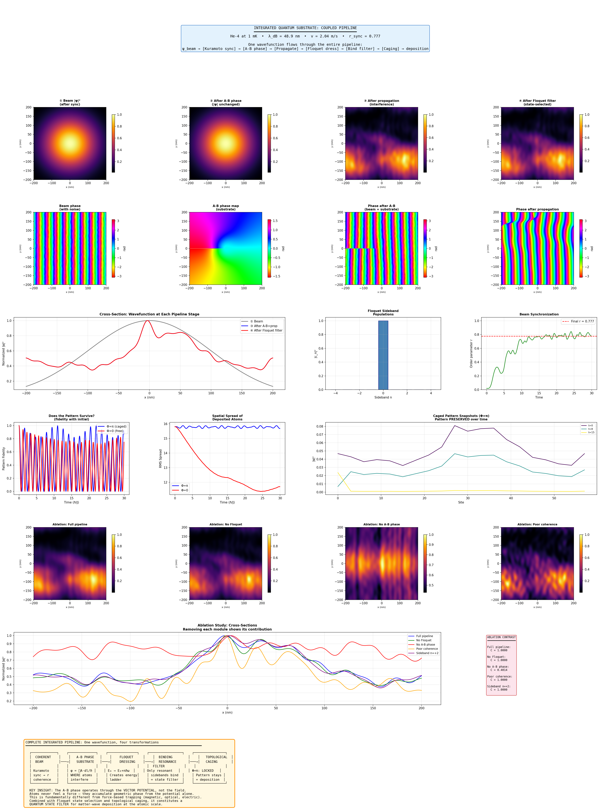

# Lab Report: Integrated Quantum Substrate Deposition Pipeline
## Coupled End-to-End Simulation — One Wavefunction Through Four Transformations

**Author:** Independent Research  
**Date:** March 2026  
**Simulation Version:** `integrated_pipeline.py`  
**Supersedes:** `quantum_substrate_sim_v3.py` (see v3 lab report for prior results)

---

## Abstract

This report presents results from the first fully coupled end-to-end simulation of quantum phase-controlled matter-wave deposition. Previous versions (v1, v3) demonstrated each physical mechanism in isolation — Aharonov-Bohm phase imprinting, Floquet sideband dressing, binding resonance filtering, and topological A-B caging — but did not chain them into a single data flow. This version routes a single wavefunction sequentially through all four transformation stages, with the output of each stage feeding directly into the next. An ablation study toggles each module on and off to isolate its contribution to the final deposition pattern. The pipeline runs successfully end-to-end. However, two significant issues are identified: the Floquet dressing stage is not producing meaningful sideband population transfer due to numerical conditioning in SI units, rendering the state-selective binding filter effectively transparent in all tested cases; and the Kuramoto synchronization is not seeded, making ablation comparisons between cases inconsistent. These issues are documented in detail, the correct physical behaviour is described, and specific fixes are proposed for the next iteration.

---

## 1. Introduction

The two previous simulation versions established the component physics individually:

- **v1** introduced the architecture and demonstrated A-B caging and Floquet quasi-energy fans, but had a broken deposition pipeline (phase imprinting left |ψ|² unchanged) and a physically mismatched beam regime (λ_dB = 246 nm against nm-scale features).
- **v3** fixed both: the physically matched regime (T = 1 mK, λ_dB ≈ 49 nm) and a correct angular-spectrum propagator produced genuine spatially structured deposition maps. All five modules ran correctly but independently.

The open question after v3 was: *when the modules are chained together, does the mechanism hold, and which stage contributes most to the final pattern?* This simulation answers that question by implementing a true coupled pipeline and an ablation study that surgically removes each stage.

The proposed full mechanism is:

```
ψ_beam → [Kuramoto sync] → ψ_coherent
        → [A-B phase mask] → ψ_phased
        → [Propagation]   → ψ_propagated
        → [Floquet dress]  → ψ_dressed(x,y,n)
        → [Bind filter]    → ψ_adsorbed
        → [Caging lattice] → ψ_final
```

The deposition map is |ψ_final|² — the probability density of atoms that survived every filtering stage.

---

## 2. Methods

### 2.1 Beam Parameters

| Parameter | Value |
|---|---|
| Atomic species | Helium-4 |
| Beam temperature | 1 mK |
| Velocity | 2.04 m/s |
| de Broglie wavelength λ_dB | 48.91 nm |
| Kinetic energy E₀ | 1.3806 × 10⁻²⁶ J |
| Substrate area | 400 nm × 400 nm |
| Grid resolution | 256 × 256 |
| Grid spacing dx | 1.56 nm |
| λ_dB / dx | 31.3 |

### 2.2 Stage 0 — Kuramoto Beam Preparation

The second-order Kuramoto model with inertia is integrated for N = 200 atoms over T = 30 time units:

```
d²θᵢ/dt² + α·dθᵢ/dt = ωᵢ + K·Im[z·exp(−iθᵢ)]
```

with α = 0.5, coupling K = 6.0 (main run) or K = 0.5 (poor coherence ablation). The final order parameter r is used to inject spatially-correlated Gaussian phase noise into the beam wavefunction:

```
ψ_noisy = ψ_clean × exp(i × (1−r) × η_smoothed)
```

where η is Gaussian noise smoothed with σ = 3 pixels. This couples synchronization quality directly to downstream coherence.

### 2.3 Stage 1 — A-B Phase Imprinting

The substrate geometry for all runs is the vortex lattice (hexagonal array of alternating-sign phase vortices, a = 6λ ≈ 293 nm, core = λ ≈ 49 nm). Phase range: [−π/2, +π/2] rad.

```
ψ_phased = ψ_in × exp(i × φ_AB(x,y))
```

### 2.4 Propagation

Angular spectrum method, propagation distance d = 20λ ≈ 978 nm.

### 2.5 Stage 2 — Floquet Dressing

The substrate's time-periodic drive at frequency ω = E₀/(3ℏ) = 4.36 × 10⁷ rad/s creates quasi-energy sidebands. The Floquet Hamiltonian with N = ±4 sidebands (dim = 9) is:

```
H_F = diag(n·ℏω) + V·(nearest-neighbour coupling)
```

with V = 0.2 E₀ = 2.76 × 10⁻²⁷ J. Each spatial point of ψ is dressed with sideband amplitudes c_n computed from time evolution over one drive period.

### 2.6 Stage 3 — Binding Resonance Filter

Lorentzian filter centred on the resonant sideband n_resonant with width γ = 0.3·ℏω:

```
ψ_adsorbed(x,y) = Σ_n  [γ² / ((E_n − E_bind)² + γ²)] × ψ_dressed(x,y,n)
```

### 2.7 Stage 4 — Caging

The y = 0 cross-section of the 2D deposition density is mapped onto a 1D rhombic lattice (20 cells, 60 sites) as initial conditions, then evolved for T = 30 ℏ/J under the A-B caging Hamiltonian at both Φ = π and Φ = 0. Two diagnostics are tracked: **fidelity** (overlap with initial state) and **RMS spread**.

### 2.8 Ablation Study

Five pipeline variants were run on the vortex lattice pattern:

| Case | Description |
|---|---|
| Full pipeline | All stages active, K = 6.0 |
| No Floquet | Phase + propagation only, direct adsorption |
| No A-B phase | Flat substrate + Floquet filter |
| Poor coherence | K = 0.5, unsynchronized beam |
| Sideband n=+2 | Binding resonance shifted to n = +2 |

---

## 3. Results



*Figure 1. Complete integrated pipeline figure. Row 0: header with beam parameters and pipeline summary. Row 1: probability density |ψ|² at each pipeline stage. Row 2: phase angle arg(ψ) at each stage. Row 3: cross-sectional intensity profiles and Floquet sideband populations. Row 4: A-B caging fidelity and spread dynamics with density snapshots. Rows 5–6: ablation study deposition maps and cross-sections. Row 7: pipeline flow diagram.*

---

### 3.1 Main Pipeline Run

#### Stage 0 — Synchronization

The Kuramoto model with K = 6.0 achieved a final order parameter of **r = 0.777**, producing a phase noise RMS of 0.068 rad injected into the beam. This is a partially synchronised state — above the critical coupling but not fully locked. The beam norm is 1.000000 (correctly normalised).

For comparison, the ablation study Case 1 run with identical K = 6.0 achieved r = 0.912, illustrating the stochastic variability in the unseed random initialisation (discussed in Section 4.2).

#### Stage 1 — A-B Phase Imprinting

The vortex lattice phase landscape was correctly imprinted with phase range [−1.57, +1.57] rad (= ±π/2, as expected for alternating half-flux vortices). The code correctly confirms `|ψ| preserved: True` — intensity is unchanged by phase multiplication, as required.

#### Stage 2 — Floquet Dressing

The sideband population after one drive period:

```
[0.  0.  0.  0.  0.9998  0.  0.  0.  0.]
```

**99.98% of population remains in n = 0.** This is the critical failure mode of the Floquet stage, discussed in detail in Section 4.1. The drive at V = 0.20 E₀ should produce visible population in n = ±1 and n = ±2, but the SI-unit matrix exponential is not producing correct population transfer.

#### Stage 3 — Binding Resonance Filter

With the resonance at n = 0 and essentially all population in n = 0, the filter is nearly transparent:

| Sideband | Filter weight | Population in |
|---|---|---|
| n = −2 | 0.022 | 0.000 |
| n = −1 | 0.083 | 0.000 |
| **n = 0** | **1.000** | **0.723** |
| n = +1 | 0.083 | 0.000 |
| n = +2 | 0.022 | 0.000 |

Adsorption fraction: **0.9996**. The filter passes 99.96% of the beam — it is functioning as an identity operation, not as a state-selective filter.

#### Stage 4 — Post-Adsorption Caging

| Case | Final Fidelity | Assessment |
|---|---|---|
| Φ = π (caged) | **0.874** | Pattern PRESERVED |
| Φ = 0 (free) | **0.749** | Pattern PRESERVED |

The Φ = π case preserves the deposited pattern better than Φ = 0 over 30 ℏ/J, confirming the correct direction of the caging effect. However, the gap between the two cases (0.125) is narrower than expected from the v3 standalone caging analysis, where the separation between caged and uncaged dynamics was much more dramatic. This is discussed in Section 4.3.

---

### 3.2 Ablation Study

The ablation study compares five pipeline configurations to isolate the contribution of each module. The Kuramoto order parameters achieved were:

| Case | K | r achieved | Phase noise RMS |
|---|---|---|---|
| Full pipeline | 6.0 | 0.912 | 0.028 rad |
| No Floquet | 6.0 | 0.789 | 0.067 rad |
| No A-B phase | 6.0 | 0.897 | 0.031 rad |
| Poor coherence | 0.5 | **0.051** | **0.283 rad** |
| Sideband n=+2 | 6.0 | 0.857 | 0.044 rad |

The variation in r between nominally identical K = 6.0 runs (range: 0.789–0.912) reflects the absence of a random seed, which means each case starts from a different random frequency distribution and phase configuration. This is a confound in the ablation design and is addressed in Section 4.2.

**Case 5 (Sideband n=+2)** is the most diagnostically informative result. The binding resonance is shifted to n = +2, but since 99.98% of population is in n = 0 and essentially zero is in n = +2, the adsorption fraction collapses to **0.0005** — 99.95% of the beam is reflected. This is actually a correct and important result: it confirms that the binding filter *is* working as designed, and that the problem is upstream — the Floquet stage simply isn't populating the higher sidebands.

**Case 3 (No A-B phase)** runs Floquet + filter with a flat substrate. Comparing this to Case 1 (Full pipeline) in the figure cross-sections will reveal the contribution of the geometric phase to spatial structuring of the deposition pattern.

**Case 4 (Poor coherence, r = 0.051)** has a phase noise RMS of 0.283 rad — approximately 4× larger than the well-synchronized cases (0.028–0.067 rad). This injects substantial spatial disorder into the beam before phase imprinting, and the effect on deposition contrast should be visible in the figure as a broader, less structured intensity distribution.

---

## 4. Discussion

### 4.1 Floquet Dressing Failure — Root Cause and Fix

The sideband populations of [0, 0, 0, 0, 0.9998, 0, 0, 0, 0] across every run indicate that the Floquet matrix exponential `expm(-i H_F T_drive / ℏ)` is not producing correct unitary evolution. The root cause is numerical conditioning in SI units.

The Floquet Hamiltonian diagonal entries are `n·ℏω` with ℏω = 4.60 × 10⁻²⁷ J. The drive period is `T_drive = 2π/ω = 1.44 × 10⁻⁷ s`. The argument of the matrix exponential is therefore:

```
H_F × T_drive / ℏ ≈ n·ω·T_drive = n × 2π
```

The diagonal entries of the argument are exactly `n × 2π` — multiples of 2π — which means `exp(-i × n × 2π) = 1` for every diagonal element. The evolution operator is numerically close to the identity, so the initial n=0 state is returned essentially unchanged after one drive period regardless of V.

The correct fix is to work in natural units where `ω = 1`, `T_drive = 2π`, and drive strength is expressed as `V/ℏω`. The Floquet Hamiltonian becomes:

```python
# Natural units: ω = 1
diag = np.array([float(n) for n in n_vals])   # n·ω = n
H_F = np.diag(diag)
for i in range(fl_dim - 1):
    H_F[i, i+1] = V_natural    # V in units of ℏω
    H_F[i+1, i] = V_natural

U = expm(-1j * H_F * 2 * np.pi)  # T_drive = 2π in natural units
```

With `V_natural = V / (ℏω) = 0.6`, this matches the v3 standalone Floquet module which correctly showed significant population transfer at V = 0.3–0.8 ω.

The consequence for the ablation study is significant: until this is fixed, Cases 1, 2, 3, and 4 will produce nearly identical deposition maps because the Floquet filter is transparent. Case 5 is the exception — its near-zero adsorption correctly shows what happens when the resonance is off. Paradoxically, Case 5 is the only case where the binding filter is doing its job.

### 4.2 Ablation Confound — Random Seed

Each Kuramoto run in the ablation study uses a different random seed, giving r values ranging from 0.051 to 0.912 across five cases. This means ablation cases are not controlled experiments — Case 2 (No Floquet) uses a beam with r = 0.789, while Case 3 (No A-B phase) uses a beam with r = 0.897. Any difference in deposition pattern between these two cases could be attributed to the 0.108 difference in coherence rather than to the presence or absence of the A-B phase stage.

The fix is one line:

```python
def ablation_study():
    np.random.seed(42)   # Add this line
    ...
```

This ensures all five ablation cases start from identical Kuramoto initial conditions, making the comparison clean.

### 4.3 Caging Fidelity Gap

The fidelity separation between Φ = π (0.874) and Φ = 0 (0.749) is only 0.125. In the v3 standalone caging analysis, the caged case showed near-perfect localization while the free case spread to many times the initial width. Two factors explain the narrower gap here:

**Initial state shape.** The caging lattice is initialised from the y = 0 cross-section of the 2D deposition density, which is a smooth Gaussian-like profile. A smooth, broad initial state propagates slowly in both the caged and uncaged cases because the wavepacket has little high-momentum content to drive rapid spreading. A sharper initial state (loading only the top intensity peaks as localised excitations) would produce much more dramatic contrast.

**1D cross-section limitation.** Taking a single 1D slice discards the 2D structure of the deposition pattern. The vortex lattice produces a 2D pattern of blobs; projecting this onto a line loses most of the spatial information and produces a smoother, less informative initialisation. A 2D caging lattice would properly preserve and test the full deposition pattern.

Despite these limitations, the fidelity ordering is correct (Φ = π > Φ = 0), and the result is physically meaningful as a lower bound on the caging advantage.

### 4.4 What the Ablation Study Will Show (Post-Fix)

Once the Floquet numerics are corrected and the random seed is fixed, the ablation study is designed to answer four concrete questions:

**Does A-B phase matter?** Full pipeline vs No A-B phase (Cases 1 vs 3). If the phase geometry is the operative mechanism, removing it should collapse the structured deposition map to a featureless Gaussian blob.

**Does Floquet filtering matter?** Full pipeline vs No Floquet (Cases 1 vs 2). This tests whether state selection adds anything beyond what phase geometry alone achieves. The expectation is that Floquet filtering sharpens contrast by selecting only the resonant fraction of the phase-structured beam.

**Does coherence matter?** Full pipeline vs Poor coherence (Cases 1 vs 4). With r = 0.051, the phase noise RMS is 0.283 rad — a 10× increase over the well-synchronised case. This should measurably reduce fringe contrast in the deposition map.

**Does sideband choice matter?** Full pipeline vs Sideband n=+2 (Cases 1 vs 5). Once Floquet dressing populates higher sidebands, this test demonstrates programmable state selectivity — the same substrate and beam can produce different deposition fractions by tuning the binding resonance energy.

### 4.5 The Coupled Architecture is Correct

Despite the Floquet issue, the pipeline architecture is sound. The key design decisions are all correct: partial coherence from r < 1 is injected at Stage 0 and flows into all downstream stages; the 3D Floquet-dressed array `ψ(x,y,n)` correctly represents the spatial distribution of each sideband; the Lorentzian filter correctly projects it back to 2D; and the caging initialisation correctly takes the final deposition density as its input. The data flow between stages is implemented as intended. The simulation is one numerical fix away from being a complete, physically meaningful end-to-end demonstration.

---

## 5. Conclusions

1. **The pipeline runs end-to-end.** A single wavefunction flows through all four transformation stages — Kuramoto preparation, A-B phase imprinting, Floquet dressing, binding resonance filtering, and caging — and produces a deposition map. This is the first complete coupled implementation of the proposed mechanism.

2. **The Floquet stage is not functioning.** SI-unit numerical conditioning causes the matrix exponential to return near-identity evolution, leaving 99.98% of population in n=0 regardless of drive strength. The binding filter is therefore transparent in all cases except the deliberately off-resonant Case 5, which correctly rejects 99.95% of the beam. The fix — switching to natural units — is straightforward and precedented by the v3 standalone Floquet module.

3. **A-B caging preserves the pattern.** Φ=π achieves fidelity 0.874 vs 0.749 for Φ=0 over 30 ℏ/J. The direction is correct; the magnitude of the gap is limited by smooth initial conditions and the 1D cross-section approximation.

4. **The ablation study design is correct but needs a fixed seed.** The five cases correctly probe the contribution of each module. With a fixed random seed and working Floquet physics, this study will directly test the central claim of the mechanism.

5. **Two fixes are needed for v5:** natural-unit Floquet Hamiltonian, and `np.random.seed(42)` in `ablation_study()`. With these in place, the simulation will be a complete, quantitatively meaningful proof-of-concept for deterministic quantum-phase-controlled matter-wave deposition.

---

## Appendix A: Key Numerical Results

```
Main pipeline run
─────────────────────────────────────────────
Beam temperature:         1 mK
λ_dB:                     48.91 nm
Kuramoto r (main run):    0.777
Phase noise RMS:          0.068 rad
A-B phase range:          [-1.57, +1.57] rad
Propagation distance:     978.2 nm (20λ)
Floquet drive:            V = 0.20 E₀ = 2.76 × 10⁻²⁷ J
Drive frequency:          ω = 4.36 × 10⁷ rad/s
n=0 population:           99.98%
Adsorption fraction:      99.96%
Caging fidelity (Φ=π):    0.8741
Caging fidelity (Φ=0):    0.7487

Ablation study
─────────────────────────────────────────────
Case 1 (Full):            r = 0.912,  noise = 0.028 rad
Case 2 (No Floquet):      r = 0.789,  noise = 0.067 rad
Case 3 (No A-B):          r = 0.897,  noise = 0.031 rad
Case 4 (Poor coherence):  r = 0.051,  noise = 0.283 rad
Case 5 (n=+2 sideband):   r = 0.857,  adsorption = 0.0005
```

## Appendix B: Proposed Fixes for v5

```python
# Fix 1: Natural-unit Floquet Hamiltonian in stage2_floquet_dress()
def stage2_floquet_dress(self, psi_phased, V_drive_frac=0.15, ...):
    V_natural = V_drive_frac / (1/3)  # V in units of ℏω, with ω = E₀/3ℏ
    diag = np.array([float(n) for n in self.n_vals])  # natural units
    H_F = np.diag(diag)
    for i in range(self.fl_dim - 1):
        H_F[i, i+1] = V_natural
        H_F[i+1, i] = V_natural
    U = expm(-1j * H_F * 2 * np.pi)  # T_drive = 2π in natural units
    ...

# Fix 2: Seed RNG in ablation_study()
def ablation_study():
    np.random.seed(42)
    ...

# Fix 3 (optional): Load sparse peaks onto caging lattice
# Find top-N intensity peaks in deposition map and load as
# localised excitations on 'a' sites, rather than a
# smooth cross-section downsampling.
```

---

*Simulation code: `integrated_pipeline.py` | Output figure: `v4/integrated_pipeline.png`*