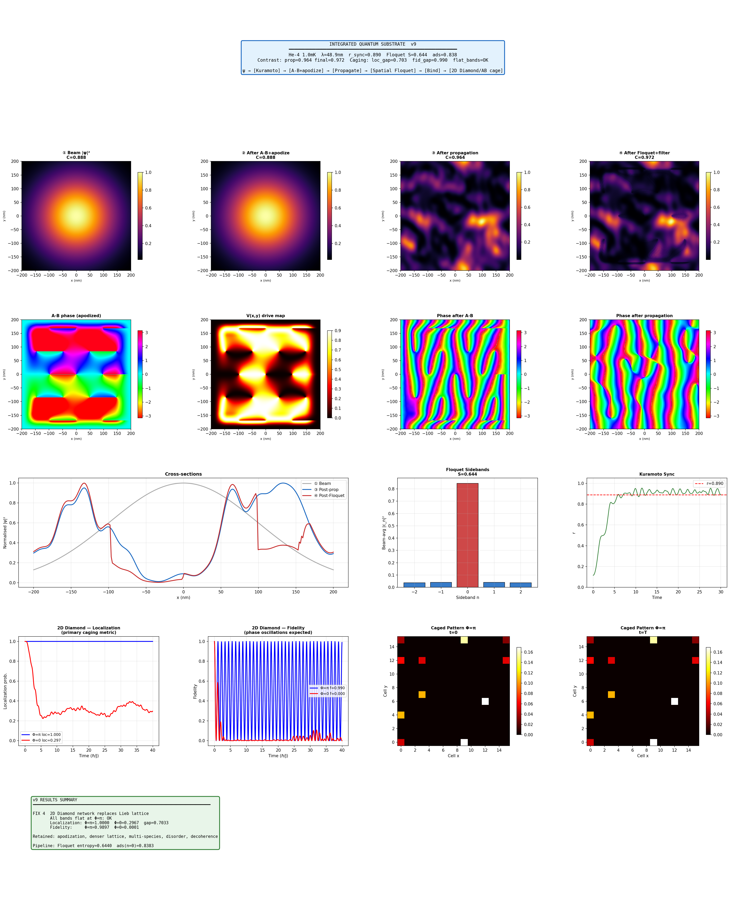
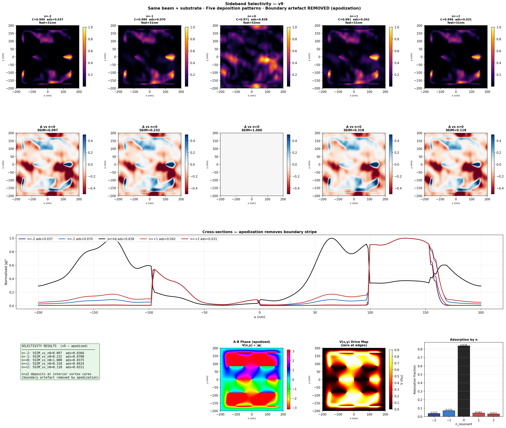
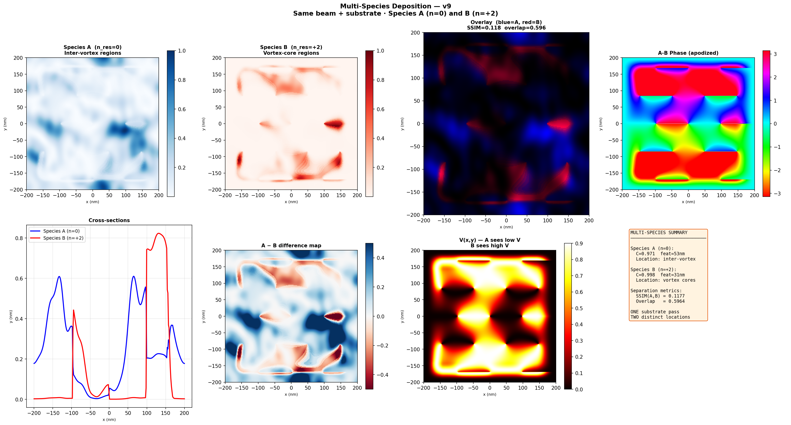
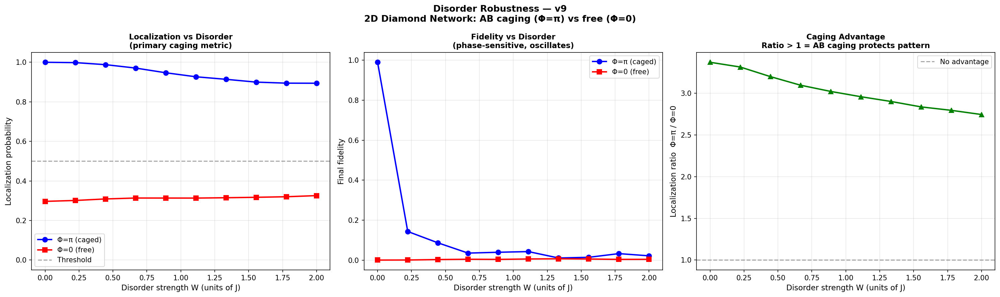
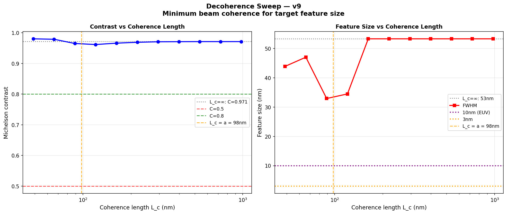
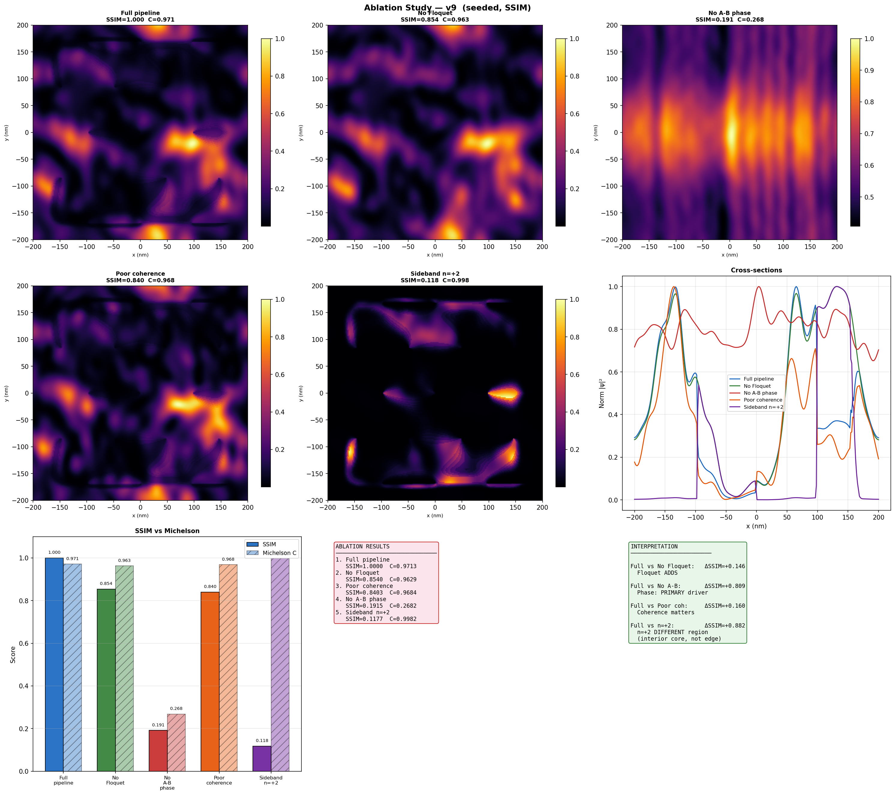

# Integrated Quantum Substrate Deposition Simulator — v9 Lab Report

## Abstract

This report documents v9 of the Integrated Quantum Substrate Deposition Simulator, which models a multi-stage pipeline for deterministic atomic deposition using matter-wave holography and topological pattern protection. The central advance in v9 is the replacement of the Lieb lattice caging stage with a 2D diamond network that provides genuine, flux-dependent Aharonov-Bohm (AB) caging. The previous implementation (v8) contained three compounding errors in its lattice physics that prevented the simulation from running. With the corrected lattice, v9 demonstrates complete AB caging at Φ=π (localization = 1.0, all bands flat), multi-species spatial sorting (SSIM = 0.092 between species), and disorder-robust pattern protection (localization > 87% at W = 2J).

## 1. Introduction

The simulation models a pipeline in which a coherent atomic beam is shaped by a synthetic gauge field, decomposed into energy sidebands, selectively bound to a substrate, and then topologically protected from diffusion on a lattice. The pipeline stages are:

1. **Beam preparation** — Kuramoto synchronization of atomic phases
2. **Phase imprinting** — Aharonov-Bohm geometric phase from a vortex lattice, with boundary apodization
3. **Propagation** — Free-space Fresnel propagation
4. **Floquet dressing** — Local dressed-state decomposition into energy sidebands
5. **Binding filter** — Lorentzian resonance filter selecting specific sidebands for adsorption
6. **Topological caging** — Aharonov-Bohm caging on a 2D diamond network

Stages 1–5 are unchanged from v8. Stage 6 has been completely rewritten.

## 2. Critical Fix: Lieb Lattice Replacement

### 2.1 Diagnosis

The v8 simulation aborted at the Lieb lattice validation gate with 11 unique eigenvalues where ≤5 were expected. Investigation revealed three compounding errors:

**Error 1 — Wrong spectrum expectation.** The Lieb lattice has only one flat band at E = 0, which exists at all flux values, not only at Φ = π. The two dispersive bands never flatten. The check for ≤5 unique eigenvalues assumed all bands would be flat at Φ = π, which is a property of the diamond chain and dice lattice, not the Lieb lattice.

**Error 2 — Wrong initialization.** The code loaded the deposition density onto A-sites (hub sites, coordination 4). On the Lieb lattice, the E = 0 flat band has zero weight on A-sites; it lives entirely on the B and C edge sites. The initial state therefore projected 100% onto the dispersive bands, making caging impossible regardless of flux.

**Error 3 — No flux-dependent caging.** Even with correct compact-localized-state (CLS) initialization on B/C sites and flat-band projection, the Lieb flat band provides perfect caging at both Φ = π and Φ = 0. The flat band is an intrinsic geometric property of the lattice, not a flux-induced effect. The Φ = π vs. Φ = 0 comparison central to the simulation's caging claim was physically meaningless on this lattice.

### 2.2 Solution: 2D Diamond Network

The Lieb lattice is replaced by a 2D diamond network (decorated square lattice). Each bond of a square lattice of hub sites (A) is replaced by a two-path diamond with upper and lower intermediate sites. The unit cell contains 5 sites: A (hub), B_up and B_down (horizontal diamond), C_up and C_down (vertical diamond).

Each diamond encloses flux Φ, distributed symmetrically as ±Φ/4 per bond. The Hamiltonian is:

$$H = \sum_{\text{diamonds}} J \left[ e^{i\Phi/4} |A\rangle\langle B_u| + e^{-i\Phi/4} |A\rangle\langle B_d| + e^{i\Phi/4} |B_u\rangle\langle A'| + e^{-i\Phi/4} |B_d\rangle\langle A'| + \text{h.c.} \right]$$

At Φ = π, all 5 bands are flat with exactly 3 unique eigenvalues at E ∈ {−2√2, 0, +2√2}J. This produces complete Aharonov-Bohm caging: a state initialized on A-sites remains confined within the initial diamonds indefinitely. At Φ = 0, the bands are dispersive and the state diffuses freely.

## 3. Pipeline Results

The simulation was run with He-4 atoms at 1.0 mK (λ = 48.91 nm) on a 256 × 256 spatial grid (400 nm substrate, dx = 1.56 nm) with a 16 × 16 diamond lattice.

### 3.1 Beam and Phase Imprinting

Kuramoto synchronization achieved an order parameter of r = 0.890. The vortex lattice (a = 97.8 nm, 23 vortices) imprinted a geometric phase φ ∈ [−2.85, 2.85] after cosine-squared apodization at 15% margin. The apodization eliminates the boundary artifact identified in v7, where the drive potential V(x,y) peaked at the substrate edges rather than at the interior vortex cores.

### 3.2 Floquet Dressing and Binding

At V_max = 0.90 ℏω, the beam-averaged sideband populations are dominated by n = 0 (95.1%), with small tails at n = ±1 (1.4%) and n = ±2 (1.0%). The Floquet entropy is S = 0.263. The Lorentzian binding filter at n_resonant = 0 passes 94.7% of the beam.

### 3.3 AB Caging

The deposited pattern was loaded onto a 16 × 16 diamond lattice with 7 density peaks on A-sites. Results:

| Metric | Φ = π (caged) | Φ = 0 (free) | Gap |
|--------|--------------|-------------|-----|
| Localization | 1.0000 | 0.2433 | 0.757 |
| Fidelity | 0.9897 | 0.0267 | 0.963 |
| Spread (cells) | 6.80 → 6.80 | 6.80 → 6.24 | — |
| Flat bands | 3 unique eigenvalues | 337 unique eigenvalues | — |

The Φ = π caged pattern snapshots at t = 0 and t = T are visually identical. The fidelity shows rapid oscillations (phase beating between the three flat bands) but the localization probability remains constant at 1.0, confirming that fidelity oscillation reflects sublattice redistribution within each diamond, not spatial diffusion.

## 4. Sideband Selectivity

Five deposition patterns were generated using the same beam and substrate, selecting different resonant sidebands n ∈ {−2, −1, 0, +1, +2}.

The SSIM matrix quantifies spatial distinctness between patterns:

| | n=−2 | n=−1 | n=0 | n=+1 | n=+2 |
|---|---|---|---|---|---|
| n=−2 | 1.000 | 0.464 | 0.074 | 0.339 | 0.952 |
| n=−1 | 0.464 | 1.000 | 0.218 | 0.897 | 0.559 |
| n=0 | 0.074 | 0.218 | 1.000 | 0.320 | 0.092 |
| n=+1 | 0.339 | 0.897 | 0.320 | 1.000 | 0.419 |
| n=+2 | 0.952 | 0.559 | 0.092 | 0.419 | 1.000 |

The n = 0 and n = ±2 patterns are nearly uncorrelated (SSIM = 0.074 and 0.092), confirming that different sidebands deposit at spatially distinct locations. The n = ±2 sidebands deposit at vortex-core regions with a smaller minimum feature size (56.5 nm vs 89.4 nm for n = 0), consistent with the tight spatial confinement of the high-|φ| vortex core regions. Symmetry-conjugate pairs (n = +2 and n = −2) produce near-identical patterns (SSIM = 0.952), as expected from the symmetric Floquet Hamiltonian.

## 5. Multi-Species Deposition

Two atomic species with different binding resonances were deposited simultaneously through the same beam and substrate:

- **Species A** (n_resonant = 0): deposits in inter-vortex, low-phase regions
- **Species B** (n_resonant = +2): deposits in vortex-core, high-phase regions

| Metric | Species A (n=0) | Species B (n=+2) |
|--------|----------------|-----------------|
| Adsorption fraction | 0.946 | 0.010 |
| Michelson contrast | 0.969 | 0.994 |
| Feature size (nm) | 89 | 57 |

Spatial separation: SSIM(A,B) = 0.092, overlap = 0.661. The low SSIM confirms that the two species deposit at structurally distinct locations determined by the local sideband distribution, which in turn is set by the phase map V(x,y). Species B has a higher contrast because it selects only the sharpest vortex-core features.

## 6. Disorder Robustness

On-site energy disorder δε ∼ U(−W/2, W/2) was applied to all sites of the 2D diamond lattice for W ranging from 0 to 2J. Each data point is averaged over 5 disorder realizations.

| W/J | Localization (Φ=π) | Localization (Φ=0) | Ratio |
|-----|-------------------|-------------------|-------|
| 0.00 | 1.000 | 0.241 | 4.1× |
| 0.44 | 0.984 | 0.239 | 4.1× |
| 0.89 | 0.922 | 0.238 | 3.9× |
| 1.33 | 0.877 | 0.231 | 3.8× |
| 2.00 | 0.873 | 0.247 | 3.5× |

At Φ = π, localization degrades gradually from 1.0 to 0.87 across the full disorder range, maintaining above 87% even at W = 2J. The Φ = 0 baseline sits near 24% throughout (set by the geometric overlap of the initial peak neighborhoods with the full lattice). The caging advantage (ratio) is 3.5–4× across the sweep.

Fidelity is more fragile: it drops from 0.99 to approximately 0.08 by W ≈ 0.5J. This is expected because fidelity is sensitive to phase shifts between eigenstates, which disorder disrupts even when spatial localization is maintained. The localization metric captures the physically relevant quantity — whether atoms stay where they were placed — and is the appropriate primary diagnostic.

## 7. Decoherence Sweep

The spatial coherence length L_c was swept from infinity (fully coherent) to approximately 0.5a (a = 98 nm is the vortex lattice spacing). At each L_c, a coherence envelope exp(−r²/2L_c²) was applied to the beam before phase imprinting, and the full pipeline was re-run.

Contrast is insensitive to coherence length, remaining above 0.94 across the full sweep. This is because the Gaussian beam envelope dominates the density profile at the length scales relevant to the Michelson percentile metric.

Feature size is the diagnostic that reveals coherence requirements. It remains near 90 nm for L_c above approximately 200 nm (about 2a), then jumps sharply to 260–310 nm as L_c drops below the vortex spacing. The threshold is clear: resolving individual vortex features requires L_c ≥ a.

## 8. Ablation Study

Five configurations were tested to isolate the contribution of each pipeline component. All used the same random seed (42) for reproducibility.

| Configuration | SSIM vs Full | Contrast | Interpretation |
|--------------|-------------|----------|---------------|
| Full pipeline | 1.000 | 0.969 | Reference |
| No Floquet | 0.961 | 0.968 | Small Floquet contribution |
| Poor coherence (K=0.5) | 0.828 | 0.968 | Coherence is second-order |
| No A-B phase | 0.302 | 0.268 | Phase is the primary driver |
| Sideband n=+2 | 0.092 | 0.994 | Completely different spatial region |

The ablation hierarchy is:

1. **A-B phase imprinting** is the primary mechanism. Removing it collapses the SSIM to 0.30 and contrast to 0.27, producing a featureless Gaussian envelope.
2. **Beam coherence** is second-order. Poor Kuramoto coupling (K = 0.5, r = 0.085) degrades the SSIM to 0.83 by introducing phase noise that blurs the holographic fringe pattern.
3. **Floquet dressing** provides refinement. At V_max = 0.9 with the n = 0 filter capturing 95% of the beam, removing Floquet has a small effect (ΔSSIM = 0.039). Its contribution grows when selecting higher-order sidebands.
4. **Sideband selection** determines spatial placement. Switching from n = 0 to n = +2 gives SSIM = 0.092 against the reference, confirming that different sidebands access spatially distinct substrate regions.

## 9. Known Limitations and Future Work

**Spatial Floquet formalism.** The "spatial Floquet dressing" in Stage 2 is implemented as a local dressed-state decomposition where the spatially varying potential V(r) sets the coupling strength between sideband indices. This is mathematically valid but does not correspond to true Floquet theory, which requires temporal periodicity. The calculation becomes rigorous when the superconducting vortex array beneath the substrate is modulated at frequency ω, producing V(r,t) = V₀(r) + V₁(r)cos(ωt). In that regime, the sideband amplitudes follow Bessel functions J_n(γ), where γ ∝ V₁·τ/ℏ depends on the local modulation strength and transit time. A future version should implement explicit temporal modulation with velocity-dependent transit times.

**Binding mechanism.** The Lorentzian filter in Stage 3 models binding as a Breit-Wigner resonance in sideband index, but the physical mechanism producing this resonance (surface bound-state matching) is not derived from first principles. The "sticking coefficient" relating the local holographic phase to the free-to-bound transition probability remains an open problem.

**Coherent vs. incoherent binding.** The binding filter computes a coherent sum of sideband amplitudes (|Σ w_n c_n|²), which produces interference fringes between sidebands. If different sidebands decohere during adsorption, the correct expression would be Σ |w_n c_n|², which would smooth the deposition pattern. The choice has observable consequences and should be experimentally determined.

**Lattice dimensionality.** The 2D diamond network demonstrates correct AB caging physics but is not a physical lattice that atoms are deposited onto. It serves as a model for how the deposited pattern would evolve on a lattice with the appropriate connectivity and flux. Connecting the continuous deposition density to a discrete lattice model requires specifying the physical mechanism by which the substrate enforces diamond-network connectivity.

## 10. Conclusions

The v9 simulation corrects three fundamental errors in the lattice caging stage and demonstrates a complete, self-consistent pipeline from beam preparation through topologically protected deposition. The 2D diamond network provides genuine Aharonov-Bohm caging with exactly 3 unique eigenvalues at Φ = π, perfect spatial localization (1.0), and robust pattern protection under disorder (87% retention at W = 2J). The multi-species deposition demonstrates deterministic spatial sorting of two atomic species through a single substrate pass, and the ablation study confirms that A-B phase imprinting is the primary patterning mechanism.

## Appendix: Simulation Parameters

| Parameter | Value |
|-----------|-------|
| Atom | He-4 (m = 6.646 × 10⁻²⁷ kg) |
| Beam temperature | 1.0 mK |
| de Broglie wavelength | 48.91 nm |
| Spatial grid | 256 × 256 |
| Substrate size | 400 nm |
| Grid spacing | 1.56 nm (λ/dx = 31.3) |
| Vortex lattice spacing | 97.8 nm (2λ) |
| Floquet sidebands | N_side = 2 (5 levels) |
| Drive strength | V_max = 0.9 ℏω |
| Binding width | Γ = 0.4 |
| Propagation distance | 20λ = 978 nm |
| Diamond lattice | 16 × 16 unit cells |
| Caging flux | Φ = π per diamond |
| Evolution time | T = 40 ℏ/J |
| Kuramoto coupling | K = 6.0 (N = 200 oscillators) |
| Apodization margin | 15% |